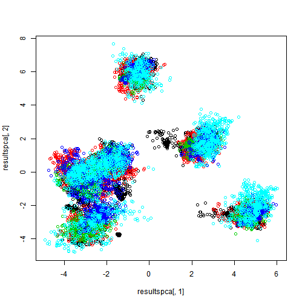

1. Read and review the dataframes 

```r
train<-read.csv("pml-training.csv",sep=",")
test<-read.csv("pml-testing.csv",sep=",")
str(train)
```

```
## 'data.frame':	19622 obs. of  160 variables:
##  $ X                       : int  1 2 3 4 5 6 7 8 9 10 ...
##  $ user_name               : Factor w/ 6 levels "adelmo","carlitos",..: 2 2 2 2 2 2 2 2 2 2 ...
##  $ raw_timestamp_part_1    : int  1323084231 1323084231 1323084231 1323084232 1323084232 1323084232 1323084232 1323084232 1323084232 1323084232 ...
##  $ raw_timestamp_part_2    : int  788290 808298 820366 120339 196328 304277 368296 440390 484323 484434 ...
##  $ cvtd_timestamp          : Factor w/ 20 levels "02/12/2011 13:32",..: 9 9 9 9 9 9 9 9 9 9 ...
##  $ new_window              : Factor w/ 2 levels "no","yes": 1 1 1 1 1 1 1 1 1 1 ...
##  $ num_window              : int  11 11 11 12 12 12 12 12 12 12 ...
##  $ roll_belt               : num  1.41 1.41 1.42 1.48 1.48 1.45 1.42 1.42 1.43 1.45 ...
##  $ pitch_belt              : num  8.07 8.07 8.07 8.05 8.07 8.06 8.09 8.13 8.16 8.17 ...
##  $ yaw_belt                : num  -94.4 -94.4 -94.4 -94.4 -94.4 -94.4 -94.4 -94.4 -94.4 -94.4 ...
##  $ total_accel_belt        : int  3 3 3 3 3 3 3 3 3 3 ...
##  $ kurtosis_roll_belt      : Factor w/ 397 levels "","-0.016850",..: 1 1 1 1 1 1 1 1 1 1 ...
##  $ kurtosis_picth_belt     : Factor w/ 317 levels "","-0.021887",..: 1 1 1 1 1 1 1 1 1 1 ...
##  $ kurtosis_yaw_belt       : Factor w/ 2 levels "","#DIV/0!": 1 1 1 1 1 1 1 1 1 1 ...
##  $ skewness_roll_belt      : Factor w/ 395 levels "","-0.003095",..: 1 1 1 1 1 1 1 1 1 1 ...
##  $ skewness_roll_belt.1    : Factor w/ 338 levels "","-0.005928",..: 1 1 1 1 1 1 1 1 1 1 ...
##  $ skewness_yaw_belt       : Factor w/ 2 levels "","#DIV/0!": 1 1 1 1 1 1 1 1 1 1 ...
##  $ max_roll_belt           : num  NA NA NA NA NA NA NA NA NA NA ...
##  $ max_picth_belt          : int  NA NA NA NA NA NA NA NA NA NA ...
##  $ max_yaw_belt            : Factor w/ 68 levels "","-0.1","-0.2",..: 1 1 1 1 1 1 1 1 1 1 ...
##  $ min_roll_belt           : num  NA NA NA NA NA NA NA NA NA NA ...
##  $ min_pitch_belt          : int  NA NA NA NA NA NA NA NA NA NA ...
##  $ min_yaw_belt            : Factor w/ 68 levels "","-0.1","-0.2",..: 1 1 1 1 1 1 1 1 1 1 ...
##  $ amplitude_roll_belt     : num  NA NA NA NA NA NA NA NA NA NA ...
##  $ amplitude_pitch_belt    : int  NA NA NA NA NA NA NA NA NA NA ...
##  $ amplitude_yaw_belt      : Factor w/ 4 levels "","#DIV/0!","0.00",..: 1 1 1 1 1 1 1 1 1 1 ...
##  $ var_total_accel_belt    : num  NA NA NA NA NA NA NA NA NA NA ...
##  $ avg_roll_belt           : num  NA NA NA NA NA NA NA NA NA NA ...
##  $ stddev_roll_belt        : num  NA NA NA NA NA NA NA NA NA NA ...
##  $ var_roll_belt           : num  NA NA NA NA NA NA NA NA NA NA ...
##  $ avg_pitch_belt          : num  NA NA NA NA NA NA NA NA NA NA ...
##  $ stddev_pitch_belt       : num  NA NA NA NA NA NA NA NA NA NA ...
##  $ var_pitch_belt          : num  NA NA NA NA NA NA NA NA NA NA ...
##  $ avg_yaw_belt            : num  NA NA NA NA NA NA NA NA NA NA ...
##  $ stddev_yaw_belt         : num  NA NA NA NA NA NA NA NA NA NA ...
##  $ var_yaw_belt            : num  NA NA NA NA NA NA NA NA NA NA ...
##  $ gyros_belt_x            : num  0 0.02 0 0.02 0.02 0.02 0.02 0.02 0.02 0.03 ...
##  $ gyros_belt_y            : num  0 0 0 0 0.02 0 0 0 0 0 ...
##  $ gyros_belt_z            : num  -0.02 -0.02 -0.02 -0.03 -0.02 -0.02 -0.02 -0.02 -0.02 0 ...
##  $ accel_belt_x            : int  -21 -22 -20 -22 -21 -21 -22 -22 -20 -21 ...
##  $ accel_belt_y            : int  4 4 5 3 2 4 3 4 2 4 ...
##  $ accel_belt_z            : int  22 22 23 21 24 21 21 21 24 22 ...
##  $ magnet_belt_x           : int  -3 -7 -2 -6 -6 0 -4 -2 1 -3 ...
##  $ magnet_belt_y           : int  599 608 600 604 600 603 599 603 602 609 ...
##  $ magnet_belt_z           : int  -313 -311 -305 -310 -302 -312 -311 -313 -312 -308 ...
##  $ roll_arm                : num  -128 -128 -128 -128 -128 -128 -128 -128 -128 -128 ...
##  $ pitch_arm               : num  22.5 22.5 22.5 22.1 22.1 22 21.9 21.8 21.7 21.6 ...
##  $ yaw_arm                 : num  -161 -161 -161 -161 -161 -161 -161 -161 -161 -161 ...
##  $ total_accel_arm         : int  34 34 34 34 34 34 34 34 34 34 ...
##  $ var_accel_arm           : num  NA NA NA NA NA NA NA NA NA NA ...
##  $ avg_roll_arm            : num  NA NA NA NA NA NA NA NA NA NA ...
##  $ stddev_roll_arm         : num  NA NA NA NA NA NA NA NA NA NA ...
##  $ var_roll_arm            : num  NA NA NA NA NA NA NA NA NA NA ...
##  $ avg_pitch_arm           : num  NA NA NA NA NA NA NA NA NA NA ...
##  $ stddev_pitch_arm        : num  NA NA NA NA NA NA NA NA NA NA ...
##  $ var_pitch_arm           : num  NA NA NA NA NA NA NA NA NA NA ...
##  $ avg_yaw_arm             : num  NA NA NA NA NA NA NA NA NA NA ...
##  $ stddev_yaw_arm          : num  NA NA NA NA NA NA NA NA NA NA ...
##  $ var_yaw_arm             : num  NA NA NA NA NA NA NA NA NA NA ...
##  $ gyros_arm_x             : num  0 0.02 0.02 0.02 0 0.02 0 0.02 0.02 0.02 ...
##  $ gyros_arm_y             : num  0 -0.02 -0.02 -0.03 -0.03 -0.03 -0.03 -0.02 -0.03 -0.03 ...
##  $ gyros_arm_z             : num  -0.02 -0.02 -0.02 0.02 0 0 0 0 -0.02 -0.02 ...
##  $ accel_arm_x             : int  -288 -290 -289 -289 -289 -289 -289 -289 -288 -288 ...
##  $ accel_arm_y             : int  109 110 110 111 111 111 111 111 109 110 ...
##  $ accel_arm_z             : int  -123 -125 -126 -123 -123 -122 -125 -124 -122 -124 ...
##  $ magnet_arm_x            : int  -368 -369 -368 -372 -374 -369 -373 -372 -369 -376 ...
##  $ magnet_arm_y            : int  337 337 344 344 337 342 336 338 341 334 ...
##  $ magnet_arm_z            : int  516 513 513 512 506 513 509 510 518 516 ...
##  $ kurtosis_roll_arm       : Factor w/ 330 levels "","-0.02438",..: 1 1 1 1 1 1 1 1 1 1 ...
##  $ kurtosis_picth_arm      : Factor w/ 328 levels "","-0.00484",..: 1 1 1 1 1 1 1 1 1 1 ...
##  $ kurtosis_yaw_arm        : Factor w/ 395 levels "","-0.01548",..: 1 1 1 1 1 1 1 1 1 1 ...
##  $ skewness_roll_arm       : Factor w/ 331 levels "","-0.00051",..: 1 1 1 1 1 1 1 1 1 1 ...
##  $ skewness_pitch_arm      : Factor w/ 328 levels "","-0.00184",..: 1 1 1 1 1 1 1 1 1 1 ...
##  $ skewness_yaw_arm        : Factor w/ 395 levels "","-0.00311",..: 1 1 1 1 1 1 1 1 1 1 ...
##  $ max_roll_arm            : num  NA NA NA NA NA NA NA NA NA NA ...
##  $ max_picth_arm           : num  NA NA NA NA NA NA NA NA NA NA ...
##  $ max_yaw_arm             : int  NA NA NA NA NA NA NA NA NA NA ...
##  $ min_roll_arm            : num  NA NA NA NA NA NA NA NA NA NA ...
##  $ min_pitch_arm           : num  NA NA NA NA NA NA NA NA NA NA ...
##  $ min_yaw_arm             : int  NA NA NA NA NA NA NA NA NA NA ...
##  $ amplitude_roll_arm      : num  NA NA NA NA NA NA NA NA NA NA ...
##  $ amplitude_pitch_arm     : num  NA NA NA NA NA NA NA NA NA NA ...
##  $ amplitude_yaw_arm       : int  NA NA NA NA NA NA NA NA NA NA ...
##  $ roll_dumbbell           : num  13.1 13.1 12.9 13.4 13.4 ...
##  $ pitch_dumbbell          : num  -70.5 -70.6 -70.3 -70.4 -70.4 ...
##  $ yaw_dumbbell            : num  -84.9 -84.7 -85.1 -84.9 -84.9 ...
##  $ kurtosis_roll_dumbbell  : Factor w/ 398 levels "","-0.0035","-0.0073",..: 1 1 1 1 1 1 1 1 1 1 ...
##  $ kurtosis_picth_dumbbell : Factor w/ 401 levels "","-0.0163","-0.0233",..: 1 1 1 1 1 1 1 1 1 1 ...
##  $ kurtosis_yaw_dumbbell   : Factor w/ 2 levels "","#DIV/0!": 1 1 1 1 1 1 1 1 1 1 ...
##  $ skewness_roll_dumbbell  : Factor w/ 401 levels "","-0.0082","-0.0096",..: 1 1 1 1 1 1 1 1 1 1 ...
##  $ skewness_pitch_dumbbell : Factor w/ 402 levels "","-0.0053","-0.0084",..: 1 1 1 1 1 1 1 1 1 1 ...
##  $ skewness_yaw_dumbbell   : Factor w/ 2 levels "","#DIV/0!": 1 1 1 1 1 1 1 1 1 1 ...
##  $ max_roll_dumbbell       : num  NA NA NA NA NA NA NA NA NA NA ...
##  $ max_picth_dumbbell      : num  NA NA NA NA NA NA NA NA NA NA ...
##  $ max_yaw_dumbbell        : Factor w/ 73 levels "","-0.1","-0.2",..: 1 1 1 1 1 1 1 1 1 1 ...
##  $ min_roll_dumbbell       : num  NA NA NA NA NA NA NA NA NA NA ...
##  $ min_pitch_dumbbell      : num  NA NA NA NA NA NA NA NA NA NA ...
##  $ min_yaw_dumbbell        : Factor w/ 73 levels "","-0.1","-0.2",..: 1 1 1 1 1 1 1 1 1 1 ...
##  $ amplitude_roll_dumbbell : num  NA NA NA NA NA NA NA NA NA NA ...
##   [list output truncated]
```

```r
str(test)
```

```
## 'data.frame':	20 obs. of  160 variables:
##  $ X                       : int  1 2 3 4 5 6 7 8 9 10 ...
##  $ user_name               : Factor w/ 6 levels "adelmo","carlitos",..: 6 5 5 1 4 5 5 5 2 3 ...
##  $ raw_timestamp_part_1    : int  1323095002 1322673067 1322673075 1322832789 1322489635 1322673149 1322673128 1322673076 1323084240 1322837822 ...
##  $ raw_timestamp_part_2    : int  868349 778725 342967 560311 814776 510661 766645 54671 916313 384285 ...
##  $ cvtd_timestamp          : Factor w/ 11 levels "02/12/2011 13:33",..: 5 10 10 1 6 11 11 10 3 2 ...
##  $ new_window              : Factor w/ 1 level "no": 1 1 1 1 1 1 1 1 1 1 ...
##  $ num_window              : int  74 431 439 194 235 504 485 440 323 664 ...
##  $ roll_belt               : num  123 1.02 0.87 125 1.35 -5.92 1.2 0.43 0.93 114 ...
##  $ pitch_belt              : num  27 4.87 1.82 -41.6 3.33 1.59 4.44 4.15 6.72 22.4 ...
##  $ yaw_belt                : num  -4.75 -88.9 -88.5 162 -88.6 -87.7 -87.3 -88.5 -93.7 -13.1 ...
##  $ total_accel_belt        : int  20 4 5 17 3 4 4 4 4 18 ...
##  $ kurtosis_roll_belt      : logi  NA NA NA NA NA NA ...
##  $ kurtosis_picth_belt     : logi  NA NA NA NA NA NA ...
##  $ kurtosis_yaw_belt       : logi  NA NA NA NA NA NA ...
##  $ skewness_roll_belt      : logi  NA NA NA NA NA NA ...
##  $ skewness_roll_belt.1    : logi  NA NA NA NA NA NA ...
##  $ skewness_yaw_belt       : logi  NA NA NA NA NA NA ...
##  $ max_roll_belt           : logi  NA NA NA NA NA NA ...
##  $ max_picth_belt          : logi  NA NA NA NA NA NA ...
##  $ max_yaw_belt            : logi  NA NA NA NA NA NA ...
##  $ min_roll_belt           : logi  NA NA NA NA NA NA ...
##  $ min_pitch_belt          : logi  NA NA NA NA NA NA ...
##  $ min_yaw_belt            : logi  NA NA NA NA NA NA ...
##  $ amplitude_roll_belt     : logi  NA NA NA NA NA NA ...
##  $ amplitude_pitch_belt    : logi  NA NA NA NA NA NA ...
##  $ amplitude_yaw_belt      : logi  NA NA NA NA NA NA ...
##  $ var_total_accel_belt    : logi  NA NA NA NA NA NA ...
##  $ avg_roll_belt           : logi  NA NA NA NA NA NA ...
##  $ stddev_roll_belt        : logi  NA NA NA NA NA NA ...
##  $ var_roll_belt           : logi  NA NA NA NA NA NA ...
##  $ avg_pitch_belt          : logi  NA NA NA NA NA NA ...
##  $ stddev_pitch_belt       : logi  NA NA NA NA NA NA ...
##  $ var_pitch_belt          : logi  NA NA NA NA NA NA ...
##  $ avg_yaw_belt            : logi  NA NA NA NA NA NA ...
##  $ stddev_yaw_belt         : logi  NA NA NA NA NA NA ...
##  $ var_yaw_belt            : logi  NA NA NA NA NA NA ...
##  $ gyros_belt_x            : num  -0.5 -0.06 0.05 0.11 0.03 0.1 -0.06 -0.18 0.1 0.14 ...
##  $ gyros_belt_y            : num  -0.02 -0.02 0.02 0.11 0.02 0.05 0 -0.02 0 0.11 ...
##  $ gyros_belt_z            : num  -0.46 -0.07 0.03 -0.16 0 -0.13 0 -0.03 -0.02 -0.16 ...
##  $ accel_belt_x            : int  -38 -13 1 46 -8 -11 -14 -10 -15 -25 ...
##  $ accel_belt_y            : int  69 11 -1 45 4 -16 2 -2 1 63 ...
##  $ accel_belt_z            : int  -179 39 49 -156 27 38 35 42 32 -158 ...
##  $ magnet_belt_x           : int  -13 43 29 169 33 31 50 39 -6 10 ...
##  $ magnet_belt_y           : int  581 636 631 608 566 638 622 635 600 601 ...
##  $ magnet_belt_z           : int  -382 -309 -312 -304 -418 -291 -315 -305 -302 -330 ...
##  $ roll_arm                : num  40.7 0 0 -109 76.1 0 0 0 -137 -82.4 ...
##  $ pitch_arm               : num  -27.8 0 0 55 2.76 0 0 0 11.2 -63.8 ...
##  $ yaw_arm                 : num  178 0 0 -142 102 0 0 0 -167 -75.3 ...
##  $ total_accel_arm         : int  10 38 44 25 29 14 15 22 34 32 ...
##  $ var_accel_arm           : logi  NA NA NA NA NA NA ...
##  $ avg_roll_arm            : logi  NA NA NA NA NA NA ...
##  $ stddev_roll_arm         : logi  NA NA NA NA NA NA ...
##  $ var_roll_arm            : logi  NA NA NA NA NA NA ...
##  $ avg_pitch_arm           : logi  NA NA NA NA NA NA ...
##  $ stddev_pitch_arm        : logi  NA NA NA NA NA NA ...
##  $ var_pitch_arm           : logi  NA NA NA NA NA NA ...
##  $ avg_yaw_arm             : logi  NA NA NA NA NA NA ...
##  $ stddev_yaw_arm          : logi  NA NA NA NA NA NA ...
##  $ var_yaw_arm             : logi  NA NA NA NA NA NA ...
##  $ gyros_arm_x             : num  -1.65 -1.17 2.1 0.22 -1.96 0.02 2.36 -3.71 0.03 0.26 ...
##  $ gyros_arm_y             : num  0.48 0.85 -1.36 -0.51 0.79 0.05 -1.01 1.85 -0.02 -0.5 ...
##  $ gyros_arm_z             : num  -0.18 -0.43 1.13 0.92 -0.54 -0.07 0.89 -0.69 -0.02 0.79 ...
##  $ accel_arm_x             : int  16 -290 -341 -238 -197 -26 99 -98 -287 -301 ...
##  $ accel_arm_y             : int  38 215 245 -57 200 130 79 175 111 -42 ...
##  $ accel_arm_z             : int  93 -90 -87 6 -30 -19 -67 -78 -122 -80 ...
##  $ magnet_arm_x            : int  -326 -325 -264 -173 -170 396 702 535 -367 -420 ...
##  $ magnet_arm_y            : int  385 447 474 257 275 176 15 215 335 294 ...
##  $ magnet_arm_z            : int  481 434 413 633 617 516 217 385 520 493 ...
##  $ kurtosis_roll_arm       : logi  NA NA NA NA NA NA ...
##  $ kurtosis_picth_arm      : logi  NA NA NA NA NA NA ...
##  $ kurtosis_yaw_arm        : logi  NA NA NA NA NA NA ...
##  $ skewness_roll_arm       : logi  NA NA NA NA NA NA ...
##  $ skewness_pitch_arm      : logi  NA NA NA NA NA NA ...
##  $ skewness_yaw_arm        : logi  NA NA NA NA NA NA ...
##  $ max_roll_arm            : logi  NA NA NA NA NA NA ...
##  $ max_picth_arm           : logi  NA NA NA NA NA NA ...
##  $ max_yaw_arm             : logi  NA NA NA NA NA NA ...
##  $ min_roll_arm            : logi  NA NA NA NA NA NA ...
##  $ min_pitch_arm           : logi  NA NA NA NA NA NA ...
##  $ min_yaw_arm             : logi  NA NA NA NA NA NA ...
##  $ amplitude_roll_arm      : logi  NA NA NA NA NA NA ...
##  $ amplitude_pitch_arm     : logi  NA NA NA NA NA NA ...
##  $ amplitude_yaw_arm       : logi  NA NA NA NA NA NA ...
##  $ roll_dumbbell           : num  -17.7 54.5 57.1 43.1 -101.4 ...
##  $ pitch_dumbbell          : num  25 -53.7 -51.4 -30 -53.4 ...
##  $ yaw_dumbbell            : num  126.2 -75.5 -75.2 -103.3 -14.2 ...
##  $ kurtosis_roll_dumbbell  : logi  NA NA NA NA NA NA ...
##  $ kurtosis_picth_dumbbell : logi  NA NA NA NA NA NA ...
##  $ kurtosis_yaw_dumbbell   : logi  NA NA NA NA NA NA ...
##  $ skewness_roll_dumbbell  : logi  NA NA NA NA NA NA ...
##  $ skewness_pitch_dumbbell : logi  NA NA NA NA NA NA ...
##  $ skewness_yaw_dumbbell   : logi  NA NA NA NA NA NA ...
##  $ max_roll_dumbbell       : logi  NA NA NA NA NA NA ...
##  $ max_picth_dumbbell      : logi  NA NA NA NA NA NA ...
##  $ max_yaw_dumbbell        : logi  NA NA NA NA NA NA ...
##  $ min_roll_dumbbell       : logi  NA NA NA NA NA NA ...
##  $ min_pitch_dumbbell      : logi  NA NA NA NA NA NA ...
##  $ min_yaw_dumbbell        : logi  NA NA NA NA NA NA ...
##  $ amplitude_roll_dumbbell : logi  NA NA NA NA NA NA ...
##   [list output truncated]
```

2. Translate the dataframe into numeric format so that further operations would be possible on it

```r
for (i in 1:159){
if ((is.factor(train[,i])==TRUE) & (is.numeric(levels(train[,i])==TRUE)))
{train[,i]<-levels(train[,i])[train[,i]]}
else
{train[,i]<-as.numeric(train[,i])}
}
train[is.na(train)]<-0
```

3. Split into train and testing sets based on rule of thumb 60%/40%

```r
library(caret)
```

```
## Warning: package 'caret' was built under R version 3.1.1
```

```
## Loading required package: ggplot2
```

```
## Warning: package 'ggplot2' was built under R version 3.1.1
```

```
## 
## Attaching package: 'ggplot2'
## 
## The following object is masked from 'package:UsingR':
## 
##     movies
## 
## 
## Attaching package: 'caret'
## 
## The following object is masked from 'package:survival':
## 
##     cluster
```

```r
inTrain<-createDataPartition(y=train$classe,p=0.6,list=FALSE)
training<-train[inTrain,]
testing<-train[-inTrain,]
```

4. First, I want to exclude the variables with near zero variability which do not impact the result, as well as 1st column


5. Next, my plan is to try several methods and compare their accuracy:
- PCA with glm
- Boosting 
- Random forests

6. The attempt to build the plot of 2 principal vectors shows poor distringuising of classes.  Thus, it makes little sense to attempt to build glm

 

7. Boosting method results into >99% accuracy for train and test sets.


```
## Loading required package: gbm
```

```
## Warning: package 'gbm' was built under R version 3.1.1
```

```
## Loading required package: parallel
## Loaded gbm 2.1
## Loading required package: plyr
```

```
## Warning: package 'plyr' was built under R version 3.1.1
```

```
## 
## Attaching package: 'plyr'
## 
## The following objects are masked from 'package:Hmisc':
## 
##     is.discrete, summarize
```

```
## Warning: package 'e1071' was built under R version 3.1.1
```

```
## 
## Attaching package: 'e1071'
## 
## The following object is masked from 'package:Hmisc':
## 
##     impute
```

```
## Iter   TrainDeviance   ValidDeviance   StepSize   Improve
##      1        1.6094             nan     0.1000    0.1226
##      2        1.5241             nan     0.1000    0.0859
##      3        1.4667             nan     0.1000    0.0629
##      4        1.4234             nan     0.1000    0.0620
##      5        1.3828             nan     0.1000    0.0519
##      6        1.3486             nan     0.1000    0.0420
##      7        1.3211             nan     0.1000    0.0411
##      8        1.2947             nan     0.1000    0.0354
##      9        1.2720             nan     0.1000    0.0412
##     10        1.2456             nan     0.1000    0.0309
##     20        1.0732             nan     0.1000    0.0223
##     40        0.8695             nan     0.1000    0.0119
##     60        0.7322             nan     0.1000    0.0096
##     80        0.6282             nan     0.1000    0.0075
##    100        0.5483             nan     0.1000    0.0043
##    120        0.4831             nan     0.1000    0.0034
##    140        0.4282             nan     0.1000    0.0035
##    150        0.4059             nan     0.1000    0.0020
## 
## Iter   TrainDeviance   ValidDeviance   StepSize   Improve
##      1        1.6094             nan     0.1000    0.2029
##      2        1.4812             nan     0.1000    0.1327
##      3        1.3946             nan     0.1000    0.1121
##      4        1.3232             nan     0.1000    0.0909
##      5        1.2654             nan     0.1000    0.0894
##      6        1.2093             nan     0.1000    0.0724
##      7        1.1633             nan     0.1000    0.0669
##      8        1.1204             nan     0.1000    0.0610
##      9        1.0820             nan     0.1000    0.0546
##     10        1.0476             nan     0.1000    0.0502
##     20        0.7947             nan     0.1000    0.0274
##     40        0.5161             nan     0.1000    0.0227
##     60        0.3497             nan     0.1000    0.0106
##     80        0.2472             nan     0.1000    0.0092
##    100        0.1812             nan     0.1000    0.0043
##    120        0.1357             nan     0.1000    0.0035
##    140        0.1026             nan     0.1000    0.0016
##    150        0.0903             nan     0.1000    0.0021
## 
## Iter   TrainDeviance   ValidDeviance   StepSize   Improve
##      1        1.6094             nan     0.1000    0.2472
##      2        1.4507             nan     0.1000    0.1820
##      3        1.3350             nan     0.1000    0.1331
##      4        1.2507             nan     0.1000    0.1144
##      5        1.1778             nan     0.1000    0.1042
##      6        1.1125             nan     0.1000    0.0942
##      7        1.0549             nan     0.1000    0.0975
##      8        0.9961             nan     0.1000    0.0712
##      9        0.9516             nan     0.1000    0.0644
##     10        0.9130             nan     0.1000    0.0598
##     20        0.6005             nan     0.1000    0.0418
##     40        0.3193             nan     0.1000    0.0133
##     60        0.1945             nan     0.1000    0.0051
##     80        0.1247             nan     0.1000    0.0054
##    100        0.0839             nan     0.1000    0.0026
##    120        0.0581             nan     0.1000    0.0006
##    140        0.0431             nan     0.1000    0.0007
##    150        0.0374             nan     0.1000    0.0010
## 
## Iter   TrainDeviance   ValidDeviance   StepSize   Improve
##      1        1.6094             nan     0.1000    0.1334
##      2        1.5218             nan     0.1000    0.0873
##      3        1.4636             nan     0.1000    0.0703
##      4        1.4188             nan     0.1000    0.0545
##      5        1.3825             nan     0.1000    0.0464
##      6        1.3518             nan     0.1000    0.0501
##      7        1.3206             nan     0.1000    0.0396
##      8        1.2957             nan     0.1000    0.0444
##      9        1.2664             nan     0.1000    0.0352
##     10        1.2442             nan     0.1000    0.0343
##     20        1.0671             nan     0.1000    0.0169
##     40        0.8592             nan     0.1000    0.0113
##     60        0.7276             nan     0.1000    0.0091
##     80        0.6237             nan     0.1000    0.0070
##    100        0.5435             nan     0.1000    0.0045
##    120        0.4798             nan     0.1000    0.0032
##    140        0.4261             nan     0.1000    0.0032
##    150        0.4046             nan     0.1000    0.0030
## 
## Iter   TrainDeviance   ValidDeviance   StepSize   Improve
##      1        1.6094             nan     0.1000    0.2023
##      2        1.4783             nan     0.1000    0.1363
##      3        1.3896             nan     0.1000    0.1083
##      4        1.3193             nan     0.1000    0.1032
##      5        1.2537             nan     0.1000    0.0779
##      6        1.2026             nan     0.1000    0.0759
##      7        1.1550             nan     0.1000    0.0692
##      8        1.1121             nan     0.1000    0.0679
##      9        1.0700             nan     0.1000    0.0472
##     10        1.0390             nan     0.1000    0.0467
##     20        0.7809             nan     0.1000    0.0341
##     40        0.5024             nan     0.1000    0.0145
##     60        0.3427             nan     0.1000    0.0121
##     80        0.2408             nan     0.1000    0.0051
##    100        0.1749             nan     0.1000    0.0035
##    120        0.1336             nan     0.1000    0.0031
##    140        0.1028             nan     0.1000    0.0028
##    150        0.0910             nan     0.1000    0.0014
## 
## Iter   TrainDeviance   ValidDeviance   StepSize   Improve
##      1        1.6094             nan     0.1000    0.2572
##      2        1.4438             nan     0.1000    0.1835
##      3        1.3268             nan     0.1000    0.1283
##      4        1.2429             nan     0.1000    0.1271
##      5        1.1648             nan     0.1000    0.0935
##      6        1.1052             nan     0.1000    0.0841
##      7        1.0510             nan     0.1000    0.0790
##      8        1.0001             nan     0.1000    0.0831
##      9        0.9463             nan     0.1000    0.0535
##     10        0.9117             nan     0.1000    0.0785
##     20        0.5990             nan     0.1000    0.0462
##     40        0.3155             nan     0.1000    0.0129
##     60        0.1859             nan     0.1000    0.0050
##     80        0.1181             nan     0.1000    0.0036
##    100        0.0815             nan     0.1000    0.0031
##    120        0.0578             nan     0.1000    0.0009
##    140        0.0438             nan     0.1000    0.0007
##    150        0.0378             nan     0.1000    0.0006
## 
## Iter   TrainDeviance   ValidDeviance   StepSize   Improve
##      1        1.6094             nan     0.1000    0.1267
##      2        1.5237             nan     0.1000    0.0876
##      3        1.4660             nan     0.1000    0.0654
##      4        1.4227             nan     0.1000    0.0536
##      5        1.3869             nan     0.1000    0.0534
##      6        1.3523             nan     0.1000    0.0488
##      7        1.3224             nan     0.1000    0.0419
##      8        1.2953             nan     0.1000    0.0345
##      9        1.2733             nan     0.1000    0.0407
##     10        1.2459             nan     0.1000    0.0362
##     20        1.0715             nan     0.1000    0.0196
##     40        0.8631             nan     0.1000    0.0110
##     60        0.7280             nan     0.1000    0.0088
##     80        0.6249             nan     0.1000    0.0073
##    100        0.5450             nan     0.1000    0.0048
##    120        0.4792             nan     0.1000    0.0034
##    140        0.4265             nan     0.1000    0.0030
##    150        0.4026             nan     0.1000    0.0015
## 
## Iter   TrainDeviance   ValidDeviance   StepSize   Improve
##      1        1.6094             nan     0.1000    0.1964
##      2        1.4822             nan     0.1000    0.1346
##      3        1.3951             nan     0.1000    0.1162
##      4        1.3218             nan     0.1000    0.0906
##      5        1.2648             nan     0.1000    0.0854
##      6        1.2105             nan     0.1000    0.0644
##      7        1.1700             nan     0.1000    0.0705
##      8        1.1240             nan     0.1000    0.0614
##      9        1.0863             nan     0.1000    0.0581
##     10        1.0500             nan     0.1000    0.0519
##     20        0.7920             nan     0.1000    0.0392
##     40        0.5123             nan     0.1000    0.0194
##     60        0.3455             nan     0.1000    0.0072
##     80        0.2474             nan     0.1000    0.0061
##    100        0.1806             nan     0.1000    0.0051
##    120        0.1365             nan     0.1000    0.0030
##    140        0.1050             nan     0.1000    0.0019
##    150        0.0936             nan     0.1000    0.0013
## 
## Iter   TrainDeviance   ValidDeviance   StepSize   Improve
##      1        1.6094             nan     0.1000    0.2505
##      2        1.4495             nan     0.1000    0.1861
##      3        1.3342             nan     0.1000    0.1312
##      4        1.2509             nan     0.1000    0.1138
##      5        1.1802             nan     0.1000    0.0960
##      6        1.1193             nan     0.1000    0.0854
##      7        1.0642             nan     0.1000    0.0773
##      8        1.0158             nan     0.1000    0.0738
##      9        0.9702             nan     0.1000    0.0731
##     10        0.9253             nan     0.1000    0.0682
##     20        0.6122             nan     0.1000    0.0356
##     40        0.3165             nan     0.1000    0.0115
##     60        0.1841             nan     0.1000    0.0065
##     80        0.1206             nan     0.1000    0.0041
##    100        0.0836             nan     0.1000    0.0028
##    120        0.0590             nan     0.1000    0.0017
##    140        0.0439             nan     0.1000    0.0013
##    150        0.0382             nan     0.1000    0.0008
## 
## Iter   TrainDeviance   ValidDeviance   StepSize   Improve
##      1        1.6094             nan     0.1000    0.1328
##      2        1.5227             nan     0.1000    0.0866
##      3        1.4645             nan     0.1000    0.0644
##      4        1.4218             nan     0.1000    0.0538
##      5        1.3862             nan     0.1000    0.0561
##      6        1.3513             nan     0.1000    0.0462
##      7        1.3224             nan     0.1000    0.0391
##      8        1.2981             nan     0.1000    0.0385
##      9        1.2716             nan     0.1000    0.0351
##     10        1.2485             nan     0.1000    0.0288
##     20        1.0760             nan     0.1000    0.0232
##     40        0.8667             nan     0.1000    0.0117
##     60        0.7336             nan     0.1000    0.0066
##     80        0.6317             nan     0.1000    0.0065
##    100        0.5511             nan     0.1000    0.0054
##    120        0.4873             nan     0.1000    0.0047
##    140        0.4334             nan     0.1000    0.0033
##    150        0.4098             nan     0.1000    0.0042
## 
## Iter   TrainDeviance   ValidDeviance   StepSize   Improve
##      1        1.6094             nan     0.1000    0.2073
##      2        1.4781             nan     0.1000    0.1301
##      3        1.3938             nan     0.1000    0.1117
##      4        1.3217             nan     0.1000    0.0896
##      5        1.2644             nan     0.1000    0.0909
##      6        1.2079             nan     0.1000    0.0649
##      7        1.1654             nan     0.1000    0.0693
##      8        1.1230             nan     0.1000    0.0717
##      9        1.0800             nan     0.1000    0.0549
##     10        1.0454             nan     0.1000    0.0485
##     20        0.7878             nan     0.1000    0.0224
##     40        0.5224             nan     0.1000    0.0239
##     60        0.3559             nan     0.1000    0.0087
##     80        0.2548             nan     0.1000    0.0091
##    100        0.1834             nan     0.1000    0.0051
##    120        0.1359             nan     0.1000    0.0037
##    140        0.1045             nan     0.1000    0.0009
##    150        0.0899             nan     0.1000    0.0016
## 
## Iter   TrainDeviance   ValidDeviance   StepSize   Improve
##      1        1.6094             nan     0.1000    0.2588
##      2        1.4468             nan     0.1000    0.1828
##      3        1.3324             nan     0.1000    0.1367
##      4        1.2452             nan     0.1000    0.1216
##      5        1.1682             nan     0.1000    0.0982
##      6        1.1057             nan     0.1000    0.0730
##      7        1.0593             nan     0.1000    0.0944
##      8        0.9981             nan     0.1000    0.0739
##      9        0.9522             nan     0.1000    0.0644
##     10        0.9124             nan     0.1000    0.0651
##     20        0.6055             nan     0.1000    0.0292
##     40        0.3183             nan     0.1000    0.0110
##     60        0.1898             nan     0.1000    0.0044
##     80        0.1217             nan     0.1000    0.0030
##    100        0.0844             nan     0.1000    0.0028
##    120        0.0605             nan     0.1000    0.0009
##    140        0.0433             nan     0.1000    0.0005
##    150        0.0372             nan     0.1000    0.0006
## 
## Iter   TrainDeviance   ValidDeviance   StepSize   Improve
##      1        1.6094             nan     0.1000    0.1248
##      2        1.5263             nan     0.1000    0.0845
##      3        1.4697             nan     0.1000    0.0659
##      4        1.4258             nan     0.1000    0.0633
##      5        1.3846             nan     0.1000    0.0467
##      6        1.3544             nan     0.1000    0.0459
##      7        1.3261             nan     0.1000    0.0418
##      8        1.2966             nan     0.1000    0.0347
##      9        1.2737             nan     0.1000    0.0297
##     10        1.2537             nan     0.1000    0.0368
##     20        1.0723             nan     0.1000    0.0232
##     40        0.8640             nan     0.1000    0.0137
##     60        0.7240             nan     0.1000    0.0067
##     80        0.6207             nan     0.1000    0.0053
##    100        0.5408             nan     0.1000    0.0050
##    120        0.4739             nan     0.1000    0.0036
##    140        0.4230             nan     0.1000    0.0042
##    150        0.3990             nan     0.1000    0.0029
## 
## Iter   TrainDeviance   ValidDeviance   StepSize   Improve
##      1        1.6094             nan     0.1000    0.1943
##      2        1.4844             nan     0.1000    0.1361
##      3        1.3954             nan     0.1000    0.1089
##      4        1.3251             nan     0.1000    0.0976
##      5        1.2630             nan     0.1000    0.0800
##      6        1.2118             nan     0.1000    0.0715
##      7        1.1646             nan     0.1000    0.0746
##      8        1.1186             nan     0.1000    0.0597
##      9        1.0811             nan     0.1000    0.0548
##     10        1.0466             nan     0.1000    0.0509
##     20        0.7851             nan     0.1000    0.0270
##     40        0.4993             nan     0.1000    0.0176
##     60        0.3398             nan     0.1000    0.0099
##     80        0.2425             nan     0.1000    0.0050
##    100        0.1734             nan     0.1000    0.0039
##    120        0.1315             nan     0.1000    0.0030
##    140        0.0999             nan     0.1000    0.0009
##    150        0.0875             nan     0.1000    0.0019
## 
## Iter   TrainDeviance   ValidDeviance   StepSize   Improve
##      1        1.6094             nan     0.1000    0.2570
##      2        1.4459             nan     0.1000    0.1770
##      3        1.3335             nan     0.1000    0.1330
##      4        1.2483             nan     0.1000    0.1182
##      5        1.1740             nan     0.1000    0.1052
##      6        1.1081             nan     0.1000    0.0899
##      7        1.0530             nan     0.1000    0.0725
##      8        1.0067             nan     0.1000    0.0784
##      9        0.9595             nan     0.1000    0.0773
##     10        0.9083             nan     0.1000    0.0693
##     20        0.5936             nan     0.1000    0.0364
##     40        0.3100             nan     0.1000    0.0155
##     60        0.1856             nan     0.1000    0.0048
##     80        0.1192             nan     0.1000    0.0041
##    100        0.0792             nan     0.1000    0.0020
##    120        0.0552             nan     0.1000    0.0022
##    140        0.0403             nan     0.1000    0.0008
##    150        0.0348             nan     0.1000    0.0003
## 
## Iter   TrainDeviance   ValidDeviance   StepSize   Improve
##      1        1.6094             nan     0.1000    0.1326
##      2        1.5226             nan     0.1000    0.0910
##      3        1.4644             nan     0.1000    0.0649
##      4        1.4208             nan     0.1000    0.0528
##      5        1.3866             nan     0.1000    0.0490
##      6        1.3549             nan     0.1000    0.0463
##      7        1.3258             nan     0.1000    0.0458
##      8        1.2980             nan     0.1000    0.0362
##      9        1.2727             nan     0.1000    0.0384
##     10        1.2498             nan     0.1000    0.0321
##     20        1.0733             nan     0.1000    0.0189
##     40        0.8644             nan     0.1000    0.0107
##     60        0.7290             nan     0.1000    0.0074
##     80        0.6240             nan     0.1000    0.0052
##    100        0.5441             nan     0.1000    0.0047
##    120        0.4792             nan     0.1000    0.0038
##    140        0.4284             nan     0.1000    0.0033
##    150        0.4057             nan     0.1000    0.0029
## 
## Iter   TrainDeviance   ValidDeviance   StepSize   Improve
##      1        1.6094             nan     0.1000    0.1971
##      2        1.4826             nan     0.1000    0.1340
##      3        1.3944             nan     0.1000    0.1119
##      4        1.3228             nan     0.1000    0.0939
##      5        1.2649             nan     0.1000    0.0785
##      6        1.2154             nan     0.1000    0.0716
##      7        1.1691             nan     0.1000    0.0723
##      8        1.1221             nan     0.1000    0.0608
##      9        1.0842             nan     0.1000    0.0642
##     10        1.0456             nan     0.1000    0.0605
##     20        0.7867             nan     0.1000    0.0287
##     40        0.5056             nan     0.1000    0.0199
##     60        0.3482             nan     0.1000    0.0108
##     80        0.2472             nan     0.1000    0.0062
##    100        0.1807             nan     0.1000    0.0040
##    120        0.1354             nan     0.1000    0.0047
##    140        0.1024             nan     0.1000    0.0012
##    150        0.0914             nan     0.1000    0.0018
## 
## Iter   TrainDeviance   ValidDeviance   StepSize   Improve
##      1        1.6094             nan     0.1000    0.2567
##      2        1.4469             nan     0.1000    0.1756
##      3        1.3370             nan     0.1000    0.1385
##      4        1.2495             nan     0.1000    0.1246
##      5        1.1711             nan     0.1000    0.0900
##      6        1.1140             nan     0.1000    0.0838
##      7        1.0598             nan     0.1000    0.0959
##      8        1.0010             nan     0.1000    0.0737
##      9        0.9549             nan     0.1000    0.0658
##     10        0.9138             nan     0.1000    0.0706
##     20        0.6116             nan     0.1000    0.0473
##     40        0.3217             nan     0.1000    0.0138
##     60        0.1869             nan     0.1000    0.0079
##     80        0.1186             nan     0.1000    0.0054
##    100        0.0806             nan     0.1000    0.0027
##    120        0.0574             nan     0.1000    0.0007
##    140        0.0409             nan     0.1000    0.0012
##    150        0.0353             nan     0.1000    0.0006
## 
## Iter   TrainDeviance   ValidDeviance   StepSize   Improve
##      1        1.6094             nan     0.1000    0.1358
##      2        1.5207             nan     0.1000    0.0879
##      3        1.4617             nan     0.1000    0.0677
##      4        1.4174             nan     0.1000    0.0556
##      5        1.3810             nan     0.1000    0.0605
##      6        1.3447             nan     0.1000    0.0449
##      7        1.3157             nan     0.1000    0.0382
##      8        1.2916             nan     0.1000    0.0317
##      9        1.2706             nan     0.1000    0.0411
##     10        1.2428             nan     0.1000    0.0367
##     20        1.0686             nan     0.1000    0.0215
##     40        0.8619             nan     0.1000    0.0122
##     60        0.7270             nan     0.1000    0.0086
##     80        0.6237             nan     0.1000    0.0086
##    100        0.5411             nan     0.1000    0.0047
##    120        0.4811             nan     0.1000    0.0047
##    140        0.4273             nan     0.1000    0.0032
##    150        0.4031             nan     0.1000    0.0041
## 
## Iter   TrainDeviance   ValidDeviance   StepSize   Improve
##      1        1.6094             nan     0.1000    0.2009
##      2        1.4778             nan     0.1000    0.1346
##      3        1.3897             nan     0.1000    0.1182
##      4        1.3138             nan     0.1000    0.0840
##      5        1.2590             nan     0.1000    0.0849
##      6        1.2053             nan     0.1000    0.0760
##      7        1.1581             nan     0.1000    0.0622
##      8        1.1191             nan     0.1000    0.0669
##      9        1.0785             nan     0.1000    0.0476
##     10        1.0474             nan     0.1000    0.0521
##     20        0.7822             nan     0.1000    0.0286
##     40        0.5046             nan     0.1000    0.0236
##     60        0.3452             nan     0.1000    0.0060
##     80        0.2472             nan     0.1000    0.0107
##    100        0.1837             nan     0.1000    0.0034
##    120        0.1378             nan     0.1000    0.0036
##    140        0.1044             nan     0.1000    0.0019
##    150        0.0931             nan     0.1000    0.0010
## 
## Iter   TrainDeviance   ValidDeviance   StepSize   Improve
##      1        1.6094             nan     0.1000    0.2613
##      2        1.4441             nan     0.1000    0.1801
##      3        1.3299             nan     0.1000    0.1360
##      4        1.2457             nan     0.1000    0.1259
##      5        1.1674             nan     0.1000    0.0879
##      6        1.1116             nan     0.1000    0.0927
##      7        1.0536             nan     0.1000    0.0888
##      8        0.9990             nan     0.1000    0.0710
##      9        0.9549             nan     0.1000    0.0714
##     10        0.9111             nan     0.1000    0.0694
##     20        0.6063             nan     0.1000    0.0422
##     40        0.3215             nan     0.1000    0.0164
##     60        0.1930             nan     0.1000    0.0063
##     80        0.1287             nan     0.1000    0.0042
##    100        0.0869             nan     0.1000    0.0016
##    120        0.0614             nan     0.1000    0.0011
##    140        0.0439             nan     0.1000    0.0009
##    150        0.0370             nan     0.1000    0.0007
## 
## Iter   TrainDeviance   ValidDeviance   StepSize   Improve
##      1        1.6094             nan     0.1000    0.1271
##      2        1.5218             nan     0.1000    0.0904
##      3        1.4624             nan     0.1000    0.0639
##      4        1.4185             nan     0.1000    0.0570
##      5        1.3811             nan     0.1000    0.0424
##      6        1.3522             nan     0.1000    0.0501
##      7        1.3206             nan     0.1000    0.0418
##      8        1.2939             nan     0.1000    0.0349
##      9        1.2689             nan     0.1000    0.0361
##     10        1.2457             nan     0.1000    0.0324
##     20        1.0704             nan     0.1000    0.0230
##     40        0.8625             nan     0.1000    0.0120
##     60        0.7250             nan     0.1000    0.0082
##     80        0.6234             nan     0.1000    0.0064
##    100        0.5453             nan     0.1000    0.0048
##    120        0.4811             nan     0.1000    0.0038
##    140        0.4273             nan     0.1000    0.0033
##    150        0.4032             nan     0.1000    0.0035
## 
## Iter   TrainDeviance   ValidDeviance   StepSize   Improve
##      1        1.6094             nan     0.1000    0.1979
##      2        1.4816             nan     0.1000    0.1390
##      3        1.3934             nan     0.1000    0.1106
##      4        1.3227             nan     0.1000    0.0919
##      5        1.2637             nan     0.1000    0.0861
##      6        1.2105             nan     0.1000    0.0804
##      7        1.1614             nan     0.1000    0.0660
##      8        1.1212             nan     0.1000    0.0566
##      9        1.0843             nan     0.1000    0.0580
##     10        1.0479             nan     0.1000    0.0515
##     20        0.7851             nan     0.1000    0.0263
##     40        0.5004             nan     0.1000    0.0162
##     60        0.3435             nan     0.1000    0.0083
##     80        0.2431             nan     0.1000    0.0056
##    100        0.1824             nan     0.1000    0.0037
##    120        0.1388             nan     0.1000    0.0025
##    140        0.1028             nan     0.1000    0.0014
##    150        0.0904             nan     0.1000    0.0016
## 
## Iter   TrainDeviance   ValidDeviance   StepSize   Improve
##      1        1.6094             nan     0.1000    0.2575
##      2        1.4457             nan     0.1000    0.1773
##      3        1.3344             nan     0.1000    0.1499
##      4        1.2412             nan     0.1000    0.1128
##      5        1.1721             nan     0.1000    0.0995
##      6        1.1106             nan     0.1000    0.0920
##      7        1.0535             nan     0.1000    0.0776
##      8        1.0030             nan     0.1000    0.0768
##      9        0.9547             nan     0.1000    0.0733
##     10        0.9097             nan     0.1000    0.0690
##     20        0.6101             nan     0.1000    0.0336
##     40        0.3145             nan     0.1000    0.0140
##     60        0.1864             nan     0.1000    0.0083
##     80        0.1195             nan     0.1000    0.0055
##    100        0.0824             nan     0.1000    0.0022
##    120        0.0602             nan     0.1000    0.0011
##    140        0.0429             nan     0.1000    0.0012
##    150        0.0374             nan     0.1000    0.0006
## 
## Iter   TrainDeviance   ValidDeviance   StepSize   Improve
##      1        1.6094             nan     0.1000    0.1339
##      2        1.5222             nan     0.1000    0.0893
##      3        1.4628             nan     0.1000    0.0686
##      4        1.4182             nan     0.1000    0.0590
##      5        1.3793             nan     0.1000    0.0492
##      6        1.3480             nan     0.1000    0.0465
##      7        1.3188             nan     0.1000    0.0395
##      8        1.2939             nan     0.1000    0.0396
##      9        1.2668             nan     0.1000    0.0374
##     10        1.2429             nan     0.1000    0.0315
##     20        1.0687             nan     0.1000    0.0181
##     40        0.8625             nan     0.1000    0.0113
##     60        0.7316             nan     0.1000    0.0074
##     80        0.6297             nan     0.1000    0.0049
##    100        0.5508             nan     0.1000    0.0052
##    120        0.4853             nan     0.1000    0.0048
##    140        0.4326             nan     0.1000    0.0035
##    150        0.4084             nan     0.1000    0.0023
## 
## Iter   TrainDeviance   ValidDeviance   StepSize   Improve
##      1        1.6094             nan     0.1000    0.2015
##      2        1.4794             nan     0.1000    0.1321
##      3        1.3945             nan     0.1000    0.1126
##      4        1.3243             nan     0.1000    0.0998
##      5        1.2607             nan     0.1000    0.0872
##      6        1.2062             nan     0.1000    0.0685
##      7        1.1626             nan     0.1000    0.0644
##      8        1.1228             nan     0.1000    0.0581
##      9        1.0862             nan     0.1000    0.0570
##     10        1.0513             nan     0.1000    0.0519
##     20        0.7894             nan     0.1000    0.0301
##     40        0.5062             nan     0.1000    0.0184
##     60        0.3592             nan     0.1000    0.0084
##     80        0.2551             nan     0.1000    0.0049
##    100        0.1884             nan     0.1000    0.0037
##    120        0.1410             nan     0.1000    0.0034
##    140        0.1090             nan     0.1000    0.0021
##    150        0.0960             nan     0.1000    0.0005
## 
## Iter   TrainDeviance   ValidDeviance   StepSize   Improve
##      1        1.6094             nan     0.1000    0.2543
##      2        1.4462             nan     0.1000    0.1844
##      3        1.3316             nan     0.1000    0.1336
##      4        1.2472             nan     0.1000    0.1098
##      5        1.1776             nan     0.1000    0.1024
##      6        1.1137             nan     0.1000    0.0804
##      7        1.0639             nan     0.1000    0.0933
##      8        1.0071             nan     0.1000    0.0772
##      9        0.9596             nan     0.1000    0.0781
##     10        0.9091             nan     0.1000    0.0662
##     20        0.6172             nan     0.1000    0.0397
##     40        0.3198             nan     0.1000    0.0105
##     60        0.1966             nan     0.1000    0.0060
##     80        0.1297             nan     0.1000    0.0050
##    100        0.0891             nan     0.1000    0.0025
##    120        0.0627             nan     0.1000    0.0014
##    140        0.0469             nan     0.1000    0.0007
##    150        0.0411             nan     0.1000    0.0009
## 
## Iter   TrainDeviance   ValidDeviance   StepSize   Improve
##      1        1.6094             nan     0.1000    0.1311
##      2        1.5253             nan     0.1000    0.0862
##      3        1.4685             nan     0.1000    0.0678
##      4        1.4247             nan     0.1000    0.0525
##      5        1.3892             nan     0.1000    0.0537
##      6        1.3541             nan     0.1000    0.0460
##      7        1.3253             nan     0.1000    0.0420
##      8        1.2983             nan     0.1000    0.0405
##      9        1.2717             nan     0.1000    0.0349
##     10        1.2495             nan     0.1000    0.0342
##     20        1.0723             nan     0.1000    0.0188
##     40        0.8615             nan     0.1000    0.0122
##     60        0.7252             nan     0.1000    0.0085
##     80        0.6226             nan     0.1000    0.0066
##    100        0.5425             nan     0.1000    0.0045
##    120        0.4787             nan     0.1000    0.0033
##    140        0.4255             nan     0.1000    0.0029
##    150        0.4027             nan     0.1000    0.0034
## 
## Iter   TrainDeviance   ValidDeviance   StepSize   Improve
##      1        1.6094             nan     0.1000    0.2089
##      2        1.4765             nan     0.1000    0.1379
##      3        1.3893             nan     0.1000    0.1119
##      4        1.3164             nan     0.1000    0.0922
##      5        1.2581             nan     0.1000    0.0749
##      6        1.2089             nan     0.1000    0.0732
##      7        1.1621             nan     0.1000    0.0562
##      8        1.1253             nan     0.1000    0.0628
##      9        1.0863             nan     0.1000    0.0557
##     10        1.0518             nan     0.1000    0.0581
##     20        0.7918             nan     0.1000    0.0329
##     40        0.5137             nan     0.1000    0.0155
##     60        0.3545             nan     0.1000    0.0086
##     80        0.2517             nan     0.1000    0.0051
##    100        0.1831             nan     0.1000    0.0028
##    120        0.1401             nan     0.1000    0.0029
##    140        0.1047             nan     0.1000    0.0022
##    150        0.0918             nan     0.1000    0.0022
## 
## Iter   TrainDeviance   ValidDeviance   StepSize   Improve
##      1        1.6094             nan     0.1000    0.2631
##      2        1.4438             nan     0.1000    0.1834
##      3        1.3289             nan     0.1000    0.1430
##      4        1.2400             nan     0.1000    0.1215
##      5        1.1640             nan     0.1000    0.1010
##      6        1.1001             nan     0.1000    0.0868
##      7        1.0444             nan     0.1000    0.0797
##      8        0.9931             nan     0.1000    0.0795
##      9        0.9443             nan     0.1000    0.0606
##     10        0.9062             nan     0.1000    0.0583
##     20        0.6047             nan     0.1000    0.0310
##     40        0.3162             nan     0.1000    0.0151
##     60        0.1912             nan     0.1000    0.0050
##     80        0.1205             nan     0.1000    0.0026
##    100        0.0797             nan     0.1000    0.0027
##    120        0.0565             nan     0.1000    0.0017
##    140        0.0410             nan     0.1000    0.0017
##    150        0.0349             nan     0.1000    0.0005
## 
## Iter   TrainDeviance   ValidDeviance   StepSize   Improve
##      1        1.6094             nan     0.1000    0.1292
##      2        1.5216             nan     0.1000    0.0903
##      3        1.4619             nan     0.1000    0.0683
##      4        1.4173             nan     0.1000    0.0606
##      5        1.3775             nan     0.1000    0.0473
##      6        1.3464             nan     0.1000    0.0460
##      7        1.3173             nan     0.1000    0.0398
##      8        1.2921             nan     0.1000    0.0440
##      9        1.2642             nan     0.1000    0.0309
##     10        1.2443             nan     0.1000    0.0344
##     20        1.0673             nan     0.1000    0.0189
##     40        0.8622             nan     0.1000    0.0109
##     60        0.7266             nan     0.1000    0.0101
##     80        0.6219             nan     0.1000    0.0071
##    100        0.5454             nan     0.1000    0.0064
##    120        0.4813             nan     0.1000    0.0045
##    140        0.4264             nan     0.1000    0.0023
##    150        0.4037             nan     0.1000    0.0028
## 
## Iter   TrainDeviance   ValidDeviance   StepSize   Improve
##      1        1.6094             nan     0.1000    0.2037
##      2        1.4781             nan     0.1000    0.1351
##      3        1.3907             nan     0.1000    0.1073
##      4        1.3213             nan     0.1000    0.0901
##      5        1.2622             nan     0.1000    0.0839
##      6        1.2088             nan     0.1000    0.0766
##      7        1.1622             nan     0.1000    0.0682
##      8        1.1198             nan     0.1000    0.0713
##      9        1.0755             nan     0.1000    0.0523
##     10        1.0419             nan     0.1000    0.0502
##     20        0.7896             nan     0.1000    0.0271
##     40        0.5174             nan     0.1000    0.0110
##     60        0.3509             nan     0.1000    0.0098
##     80        0.2526             nan     0.1000    0.0099
##    100        0.1836             nan     0.1000    0.0053
##    120        0.1351             nan     0.1000    0.0049
##    140        0.1017             nan     0.1000    0.0017
##    150        0.0890             nan     0.1000    0.0025
## 
## Iter   TrainDeviance   ValidDeviance   StepSize   Improve
##      1        1.6094             nan     0.1000    0.2628
##      2        1.4444             nan     0.1000    0.1775
##      3        1.3304             nan     0.1000    0.1427
##      4        1.2408             nan     0.1000    0.1093
##      5        1.1706             nan     0.1000    0.1103
##      6        1.1024             nan     0.1000    0.0764
##      7        1.0541             nan     0.1000    0.0955
##      8        0.9913             nan     0.1000    0.0745
##      9        0.9459             nan     0.1000    0.0702
##     10        0.9021             nan     0.1000    0.0591
##     20        0.5920             nan     0.1000    0.0366
##     40        0.3185             nan     0.1000    0.0093
##     60        0.1853             nan     0.1000    0.0068
##     80        0.1190             nan     0.1000    0.0032
##    100        0.0804             nan     0.1000    0.0029
##    120        0.0553             nan     0.1000    0.0010
##    140        0.0404             nan     0.1000    0.0012
##    150        0.0337             nan     0.1000    0.0005
## 
## Iter   TrainDeviance   ValidDeviance   StepSize   Improve
##      1        1.6094             nan     0.1000    0.1345
##      2        1.5211             nan     0.1000    0.0880
##      3        1.4630             nan     0.1000    0.0679
##      4        1.4178             nan     0.1000    0.0529
##      5        1.3815             nan     0.1000    0.0539
##      6        1.3467             nan     0.1000    0.0479
##      7        1.3163             nan     0.1000    0.0418
##      8        1.2902             nan     0.1000    0.0373
##      9        1.2663             nan     0.1000    0.0319
##     10        1.2462             nan     0.1000    0.0376
##     20        1.0691             nan     0.1000    0.0234
##     40        0.8611             nan     0.1000    0.0093
##     60        0.7232             nan     0.1000    0.0083
##     80        0.6220             nan     0.1000    0.0066
##    100        0.5423             nan     0.1000    0.0057
##    120        0.4786             nan     0.1000    0.0039
##    140        0.4251             nan     0.1000    0.0033
##    150        0.4027             nan     0.1000    0.0025
## 
## Iter   TrainDeviance   ValidDeviance   StepSize   Improve
##      1        1.6094             nan     0.1000    0.2067
##      2        1.4750             nan     0.1000    0.1342
##      3        1.3872             nan     0.1000    0.1143
##      4        1.3162             nan     0.1000    0.0918
##      5        1.2583             nan     0.1000    0.0822
##      6        1.2063             nan     0.1000    0.0719
##      7        1.1610             nan     0.1000    0.0695
##      8        1.1178             nan     0.1000    0.0683
##      9        1.0761             nan     0.1000    0.0595
##     10        1.0386             nan     0.1000    0.0517
##     20        0.7914             nan     0.1000    0.0494
##     40        0.5045             nan     0.1000    0.0166
##     60        0.3511             nan     0.1000    0.0097
##     80        0.2474             nan     0.1000    0.0070
##    100        0.1815             nan     0.1000    0.0044
##    120        0.1338             nan     0.1000    0.0034
##    140        0.1043             nan     0.1000    0.0010
##    150        0.0897             nan     0.1000    0.0021
## 
## Iter   TrainDeviance   ValidDeviance   StepSize   Improve
##      1        1.6094             nan     0.1000    0.2626
##      2        1.4447             nan     0.1000    0.1838
##      3        1.3300             nan     0.1000    0.1348
##      4        1.2459             nan     0.1000    0.1259
##      5        1.1691             nan     0.1000    0.1076
##      6        1.1021             nan     0.1000    0.0822
##      7        1.0501             nan     0.1000    0.0725
##      8        1.0052             nan     0.1000    0.0786
##      9        0.9561             nan     0.1000    0.0797
##     10        0.9086             nan     0.1000    0.0498
##     20        0.6032             nan     0.1000    0.0453
##     40        0.3080             nan     0.1000    0.0091
##     60        0.1861             nan     0.1000    0.0062
##     80        0.1171             nan     0.1000    0.0041
##    100        0.0808             nan     0.1000    0.0024
##    120        0.0572             nan     0.1000    0.0004
##    140        0.0405             nan     0.1000    0.0007
##    150        0.0352             nan     0.1000    0.0009
## 
## Iter   TrainDeviance   ValidDeviance   StepSize   Improve
##      1        1.6094             nan     0.1000    0.1300
##      2        1.5251             nan     0.1000    0.0851
##      3        1.4693             nan     0.1000    0.0641
##      4        1.4273             nan     0.1000    0.0523
##      5        1.3927             nan     0.1000    0.0547
##      6        1.3589             nan     0.1000    0.0468
##      7        1.3299             nan     0.1000    0.0375
##      8        1.3051             nan     0.1000    0.0411
##      9        1.2778             nan     0.1000    0.0341
##     10        1.2556             nan     0.1000    0.0338
##     20        1.0814             nan     0.1000    0.0204
##     40        0.8723             nan     0.1000    0.0121
##     60        0.7317             nan     0.1000    0.0078
##     80        0.6330             nan     0.1000    0.0064
##    100        0.5530             nan     0.1000    0.0043
##    120        0.4861             nan     0.1000    0.0036
##    140        0.4332             nan     0.1000    0.0032
##    150        0.4106             nan     0.1000    0.0016
## 
## Iter   TrainDeviance   ValidDeviance   StepSize   Improve
##      1        1.6094             nan     0.1000    0.1912
##      2        1.4855             nan     0.1000    0.1350
##      3        1.4001             nan     0.1000    0.1099
##      4        1.3287             nan     0.1000    0.0952
##      5        1.2684             nan     0.1000    0.0934
##      6        1.2100             nan     0.1000    0.0671
##      7        1.1674             nan     0.1000    0.0656
##      8        1.1267             nan     0.1000    0.0544
##      9        1.0915             nan     0.1000    0.0635
##     10        1.0522             nan     0.1000    0.0525
##     20        0.7908             nan     0.1000    0.0336
##     40        0.5076             nan     0.1000    0.0190
##     60        0.3546             nan     0.1000    0.0054
##     80        0.2596             nan     0.1000    0.0059
##    100        0.1877             nan     0.1000    0.0029
##    120        0.1398             nan     0.1000    0.0023
##    140        0.1057             nan     0.1000    0.0013
##    150        0.0926             nan     0.1000    0.0013
## 
## Iter   TrainDeviance   ValidDeviance   StepSize   Improve
##      1        1.6094             nan     0.1000    0.2458
##      2        1.4526             nan     0.1000    0.1791
##      3        1.3412             nan     0.1000    0.1402
##      4        1.2538             nan     0.1000    0.1169
##      5        1.1788             nan     0.1000    0.1025
##      6        1.1136             nan     0.1000    0.0803
##      7        1.0628             nan     0.1000    0.0853
##      8        1.0106             nan     0.1000    0.0885
##      9        0.9574             nan     0.1000    0.0589
##     10        0.9201             nan     0.1000    0.0669
##     20        0.6231             nan     0.1000    0.0412
##     40        0.3257             nan     0.1000    0.0164
##     60        0.1944             nan     0.1000    0.0092
##     80        0.1252             nan     0.1000    0.0041
##    100        0.0861             nan     0.1000    0.0019
##    120        0.0600             nan     0.1000    0.0016
##    140        0.0447             nan     0.1000    0.0009
##    150        0.0390             nan     0.1000    0.0009
## 
## Iter   TrainDeviance   ValidDeviance   StepSize   Improve
##      1        1.6094             nan     0.1000    0.1219
##      2        1.5262             nan     0.1000    0.0850
##      3        1.4687             nan     0.1000    0.0617
##      4        1.4262             nan     0.1000    0.0503
##      5        1.3920             nan     0.1000    0.0553
##      6        1.3573             nan     0.1000    0.0446
##      7        1.3280             nan     0.1000    0.0401
##      8        1.3028             nan     0.1000    0.0398
##      9        1.2762             nan     0.1000    0.0393
##     10        1.2522             nan     0.1000    0.0323
##     20        1.0762             nan     0.1000    0.0191
##     40        0.8695             nan     0.1000    0.0103
##     60        0.7348             nan     0.1000    0.0104
##     80        0.6289             nan     0.1000    0.0053
##    100        0.5471             nan     0.1000    0.0055
##    120        0.4818             nan     0.1000    0.0036
##    140        0.4308             nan     0.1000    0.0032
##    150        0.4076             nan     0.1000    0.0030
## 
## Iter   TrainDeviance   ValidDeviance   StepSize   Improve
##      1        1.6094             nan     0.1000    0.1977
##      2        1.4811             nan     0.1000    0.1297
##      3        1.3969             nan     0.1000    0.1130
##      4        1.3242             nan     0.1000    0.1013
##      5        1.2609             nan     0.1000    0.0808
##      6        1.2104             nan     0.1000    0.0678
##      7        1.1660             nan     0.1000    0.0666
##      8        1.1251             nan     0.1000    0.0608
##      9        1.0877             nan     0.1000    0.0547
##     10        1.0536             nan     0.1000    0.0519
##     20        0.7869             nan     0.1000    0.0310
##     40        0.5058             nan     0.1000    0.0132
##     60        0.3490             nan     0.1000    0.0116
##     80        0.2467             nan     0.1000    0.0059
##    100        0.1820             nan     0.1000    0.0038
##    120        0.1360             nan     0.1000    0.0034
##    140        0.1036             nan     0.1000    0.0016
##    150        0.0891             nan     0.1000    0.0017
## 
## Iter   TrainDeviance   ValidDeviance   StepSize   Improve
##      1        1.6094             nan     0.1000    0.2500
##      2        1.4502             nan     0.1000    0.1824
##      3        1.3366             nan     0.1000    0.1342
##      4        1.2519             nan     0.1000    0.1299
##      5        1.1727             nan     0.1000    0.0981
##      6        1.1119             nan     0.1000    0.1029
##      7        1.0479             nan     0.1000    0.0785
##      8        0.9996             nan     0.1000    0.0788
##      9        0.9480             nan     0.1000    0.0759
##     10        0.9028             nan     0.1000    0.0657
##     20        0.5848             nan     0.1000    0.0373
##     40        0.3137             nan     0.1000    0.0121
##     60        0.1819             nan     0.1000    0.0085
##     80        0.1175             nan     0.1000    0.0034
##    100        0.0800             nan     0.1000    0.0026
##    120        0.0562             nan     0.1000    0.0010
##    140        0.0412             nan     0.1000    0.0013
##    150        0.0354             nan     0.1000    0.0006
## 
## Iter   TrainDeviance   ValidDeviance   StepSize   Improve
##      1        1.6094             nan     0.1000    0.1291
##      2        1.5223             nan     0.1000    0.0883
##      3        1.4636             nan     0.1000    0.0663
##      4        1.4193             nan     0.1000    0.0533
##      5        1.3839             nan     0.1000    0.0523
##      6        1.3500             nan     0.1000    0.0412
##      7        1.3232             nan     0.1000    0.0414
##      8        1.2969             nan     0.1000    0.0425
##      9        1.2692             nan     0.1000    0.0333
##     10        1.2476             nan     0.1000    0.0354
##     20        1.0748             nan     0.1000    0.0202
##     40        0.8632             nan     0.1000    0.0114
##     60        0.7271             nan     0.1000    0.0078
##     80        0.6284             nan     0.1000    0.0064
##    100        0.5497             nan     0.1000    0.0058
##    120        0.4853             nan     0.1000    0.0042
##    140        0.4322             nan     0.1000    0.0030
##    150        0.4080             nan     0.1000    0.0037
## 
## Iter   TrainDeviance   ValidDeviance   StepSize   Improve
##      1        1.6094             nan     0.1000    0.2060
##      2        1.4755             nan     0.1000    0.1367
##      3        1.3881             nan     0.1000    0.1043
##      4        1.3210             nan     0.1000    0.0990
##      5        1.2600             nan     0.1000    0.0803
##      6        1.2083             nan     0.1000    0.0773
##      7        1.1595             nan     0.1000    0.0592
##      8        1.1209             nan     0.1000    0.0561
##      9        1.0833             nan     0.1000    0.0582
##     10        1.0463             nan     0.1000    0.0530
##     20        0.7882             nan     0.1000    0.0311
##     40        0.5030             nan     0.1000    0.0107
##     60        0.3480             nan     0.1000    0.0092
##     80        0.2473             nan     0.1000    0.0077
##    100        0.1809             nan     0.1000    0.0049
##    120        0.1348             nan     0.1000    0.0013
##    140        0.1036             nan     0.1000    0.0034
##    150        0.0890             nan     0.1000    0.0012
## 
## Iter   TrainDeviance   ValidDeviance   StepSize   Improve
##      1        1.6094             nan     0.1000    0.2658
##      2        1.4435             nan     0.1000    0.1827
##      3        1.3306             nan     0.1000    0.1378
##      4        1.2434             nan     0.1000    0.1279
##      5        1.1647             nan     0.1000    0.0944
##      6        1.1035             nan     0.1000    0.0827
##      7        1.0523             nan     0.1000    0.0854
##      8        1.0000             nan     0.1000    0.0682
##      9        0.9525             nan     0.1000    0.0712
##     10        0.9080             nan     0.1000    0.0687
##     20        0.6016             nan     0.1000    0.0372
##     40        0.3154             nan     0.1000    0.0157
##     60        0.1826             nan     0.1000    0.0069
##     80        0.1146             nan     0.1000    0.0041
##    100        0.0751             nan     0.1000    0.0016
##    120        0.0519             nan     0.1000    0.0013
##    140        0.0384             nan     0.1000    0.0010
##    150        0.0332             nan     0.1000    0.0011
## 
## Iter   TrainDeviance   ValidDeviance   StepSize   Improve
##      1        1.6094             nan     0.1000    0.1272
##      2        1.5257             nan     0.1000    0.0892
##      3        1.4672             nan     0.1000    0.0645
##      4        1.4232             nan     0.1000    0.0524
##      5        1.3872             nan     0.1000    0.0566
##      6        1.3515             nan     0.1000    0.0421
##      7        1.3237             nan     0.1000    0.0375
##      8        1.2986             nan     0.1000    0.0428
##      9        1.2705             nan     0.1000    0.0310
##     10        1.2499             nan     0.1000    0.0346
##     20        1.0712             nan     0.1000    0.0218
##     40        0.8609             nan     0.1000    0.0139
##     60        0.7245             nan     0.1000    0.0096
##     80        0.6209             nan     0.1000    0.0074
##    100        0.5446             nan     0.1000    0.0059
##    120        0.4806             nan     0.1000    0.0045
##    140        0.4278             nan     0.1000    0.0033
##    150        0.4069             nan     0.1000    0.0027
## 
## Iter   TrainDeviance   ValidDeviance   StepSize   Improve
##      1        1.6094             nan     0.1000    0.2073
##      2        1.4778             nan     0.1000    0.1364
##      3        1.3907             nan     0.1000    0.1071
##      4        1.3204             nan     0.1000    0.0914
##      5        1.2601             nan     0.1000    0.0833
##      6        1.2073             nan     0.1000    0.0763
##      7        1.1592             nan     0.1000    0.0662
##      8        1.1169             nan     0.1000    0.0549
##      9        1.0818             nan     0.1000    0.0563
##     10        1.0458             nan     0.1000    0.0462
##     20        0.7990             nan     0.1000    0.0250
##     40        0.5142             nan     0.1000    0.0143
##     60        0.3499             nan     0.1000    0.0081
##     80        0.2513             nan     0.1000    0.0059
##    100        0.1848             nan     0.1000    0.0057
##    120        0.1388             nan     0.1000    0.0033
##    140        0.1046             nan     0.1000    0.0018
##    150        0.0930             nan     0.1000    0.0014
## 
## Iter   TrainDeviance   ValidDeviance   StepSize   Improve
##      1        1.6094             nan     0.1000    0.2626
##      2        1.4445             nan     0.1000    0.1854
##      3        1.3298             nan     0.1000    0.1407
##      4        1.2409             nan     0.1000    0.1202
##      5        1.1660             nan     0.1000    0.0941
##      6        1.1067             nan     0.1000    0.0761
##      7        1.0577             nan     0.1000    0.0809
##      8        1.0090             nan     0.1000    0.0842
##      9        0.9573             nan     0.1000    0.0630
##     10        0.9177             nan     0.1000    0.0729
##     20        0.6000             nan     0.1000    0.0289
##     40        0.3212             nan     0.1000    0.0126
##     60        0.1868             nan     0.1000    0.0082
##     80        0.1189             nan     0.1000    0.0030
##    100        0.0819             nan     0.1000    0.0024
##    120        0.0597             nan     0.1000    0.0018
##    140        0.0436             nan     0.1000    0.0004
##    150        0.0385             nan     0.1000    0.0003
## 
## Iter   TrainDeviance   ValidDeviance   StepSize   Improve
##      1        1.6094             nan     0.1000    0.1266
##      2        1.5245             nan     0.1000    0.0891
##      3        1.4656             nan     0.1000    0.0652
##      4        1.4216             nan     0.1000    0.0601
##      5        1.3823             nan     0.1000    0.0488
##      6        1.3505             nan     0.1000    0.0397
##      7        1.3246             nan     0.1000    0.0363
##      8        1.2993             nan     0.1000    0.0409
##      9        1.2718             nan     0.1000    0.0373
##     10        1.2474             nan     0.1000    0.0320
##     20        1.0737             nan     0.1000    0.0199
##     40        0.8652             nan     0.1000    0.0125
##     60        0.7288             nan     0.1000    0.0074
##     80        0.6276             nan     0.1000    0.0053
##    100        0.5510             nan     0.1000    0.0078
##    120        0.4816             nan     0.1000    0.0038
##    140        0.4291             nan     0.1000    0.0024
##    150        0.4073             nan     0.1000    0.0033
## 
## Iter   TrainDeviance   ValidDeviance   StepSize   Improve
##      1        1.6094             nan     0.1000    0.2051
##      2        1.4787             nan     0.1000    0.1340
##      3        1.3909             nan     0.1000    0.1102
##      4        1.3206             nan     0.1000    0.0905
##      5        1.2630             nan     0.1000    0.0841
##      6        1.2102             nan     0.1000    0.0734
##      7        1.1632             nan     0.1000    0.0664
##      8        1.1208             nan     0.1000    0.0569
##      9        1.0845             nan     0.1000    0.0623
##     10        1.0464             nan     0.1000    0.0490
##     20        0.7870             nan     0.1000    0.0365
##     40        0.5108             nan     0.1000    0.0218
##     60        0.3529             nan     0.1000    0.0116
##     80        0.2518             nan     0.1000    0.0046
##    100        0.1836             nan     0.1000    0.0056
##    120        0.1384             nan     0.1000    0.0038
##    140        0.1037             nan     0.1000    0.0013
##    150        0.0913             nan     0.1000    0.0010
## 
## Iter   TrainDeviance   ValidDeviance   StepSize   Improve
##      1        1.6094             nan     0.1000    0.2613
##      2        1.4441             nan     0.1000    0.1771
##      3        1.3319             nan     0.1000    0.1437
##      4        1.2430             nan     0.1000    0.1154
##      5        1.1700             nan     0.1000    0.0981
##      6        1.1087             nan     0.1000    0.0869
##      7        1.0527             nan     0.1000    0.0928
##      8        0.9955             nan     0.1000    0.0651
##      9        0.9539             nan     0.1000    0.0774
##     10        0.9031             nan     0.1000    0.0684
##     20        0.6034             nan     0.1000    0.0385
##     40        0.3189             nan     0.1000    0.0106
##     60        0.1932             nan     0.1000    0.0084
##     80        0.1201             nan     0.1000    0.0028
##    100        0.0813             nan     0.1000    0.0024
##    120        0.0578             nan     0.1000    0.0011
##    140        0.0432             nan     0.1000    0.0004
##    150        0.0375             nan     0.1000    0.0008
## 
## Iter   TrainDeviance   ValidDeviance   StepSize   Improve
##      1        1.6094             nan     0.1000    0.1317
##      2        1.5229             nan     0.1000    0.0870
##      3        1.4647             nan     0.1000    0.0650
##      4        1.4208             nan     0.1000    0.0557
##      5        1.3846             nan     0.1000    0.0572
##      6        1.3494             nan     0.1000    0.0460
##      7        1.3201             nan     0.1000    0.0412
##      8        1.2941             nan     0.1000    0.0387
##      9        1.2694             nan     0.1000    0.0388
##     10        1.2430             nan     0.1000    0.0309
##     20        1.0679             nan     0.1000    0.0216
##     40        0.8604             nan     0.1000    0.0096
##     60        0.7257             nan     0.1000    0.0077
##     80        0.6266             nan     0.1000    0.0070
##    100        0.5451             nan     0.1000    0.0045
##    120        0.4811             nan     0.1000    0.0048
##    140        0.4281             nan     0.1000    0.0036
##    150        0.4044             nan     0.1000    0.0020
## 
## Iter   TrainDeviance   ValidDeviance   StepSize   Improve
##      1        1.6094             nan     0.1000    0.2079
##      2        1.4767             nan     0.1000    0.1337
##      3        1.3913             nan     0.1000    0.1163
##      4        1.3166             nan     0.1000    0.0950
##      5        1.2574             nan     0.1000    0.0756
##      6        1.2083             nan     0.1000    0.0858
##      7        1.1555             nan     0.1000    0.0558
##      8        1.1190             nan     0.1000    0.0647
##      9        1.0787             nan     0.1000    0.0585
##     10        1.0428             nan     0.1000    0.0476
##     20        0.7846             nan     0.1000    0.0371
##     40        0.5088             nan     0.1000    0.0181
##     60        0.3521             nan     0.1000    0.0096
##     80        0.2501             nan     0.1000    0.0077
##    100        0.1816             nan     0.1000    0.0030
##    120        0.1404             nan     0.1000    0.0027
##    140        0.1064             nan     0.1000    0.0035
##    150        0.0928             nan     0.1000    0.0012
## 
## Iter   TrainDeviance   ValidDeviance   StepSize   Improve
##      1        1.6094             nan     0.1000    0.2535
##      2        1.4492             nan     0.1000    0.1842
##      3        1.3337             nan     0.1000    0.1394
##      4        1.2469             nan     0.1000    0.1155
##      5        1.1748             nan     0.1000    0.1067
##      6        1.1087             nan     0.1000    0.0838
##      7        1.0549             nan     0.1000    0.0908
##      8        0.9981             nan     0.1000    0.0766
##      9        0.9503             nan     0.1000    0.0712
##     10        0.9077             nan     0.1000    0.0695
##     20        0.6028             nan     0.1000    0.0321
##     40        0.3173             nan     0.1000    0.0160
##     60        0.1864             nan     0.1000    0.0065
##     80        0.1238             nan     0.1000    0.0043
##    100        0.0824             nan     0.1000    0.0020
##    120        0.0587             nan     0.1000    0.0021
##    140        0.0432             nan     0.1000    0.0006
##    150        0.0379             nan     0.1000    0.0006
## 
## Iter   TrainDeviance   ValidDeviance   StepSize   Improve
##      1        1.6094             nan     0.1000    0.1320
##      2        1.5227             nan     0.1000    0.0894
##      3        1.4645             nan     0.1000    0.0681
##      4        1.4196             nan     0.1000    0.0552
##      5        1.3834             nan     0.1000    0.0531
##      6        1.3487             nan     0.1000    0.0375
##      7        1.3230             nan     0.1000    0.0441
##      8        1.2963             nan     0.1000    0.0440
##      9        1.2677             nan     0.1000    0.0342
##     10        1.2454             nan     0.1000    0.0330
##     20        1.0685             nan     0.1000    0.0206
##     40        0.8591             nan     0.1000    0.0136
##     60        0.7281             nan     0.1000    0.0075
##     80        0.6264             nan     0.1000    0.0060
##    100        0.5435             nan     0.1000    0.0046
##    120        0.4816             nan     0.1000    0.0042
##    140        0.4286             nan     0.1000    0.0029
##    150        0.4054             nan     0.1000    0.0048
## 
## Iter   TrainDeviance   ValidDeviance   StepSize   Improve
##      1        1.6094             nan     0.1000    0.1980
##      2        1.4805             nan     0.1000    0.1391
##      3        1.3923             nan     0.1000    0.1090
##      4        1.3225             nan     0.1000    0.1009
##      5        1.2580             nan     0.1000    0.0831
##      6        1.2053             nan     0.1000    0.0780
##      7        1.1565             nan     0.1000    0.0600
##      8        1.1181             nan     0.1000    0.0629
##      9        1.0790             nan     0.1000    0.0555
##     10        1.0444             nan     0.1000    0.0533
##     20        0.7819             nan     0.1000    0.0309
##     40        0.5045             nan     0.1000    0.0129
##     60        0.3499             nan     0.1000    0.0105
##     80        0.2553             nan     0.1000    0.0084
##    100        0.1849             nan     0.1000    0.0033
##    120        0.1396             nan     0.1000    0.0030
##    140        0.1062             nan     0.1000    0.0027
##    150        0.0928             nan     0.1000    0.0020
## 
## Iter   TrainDeviance   ValidDeviance   StepSize   Improve
##      1        1.6094             nan     0.1000    0.2534
##      2        1.4477             nan     0.1000    0.1891
##      3        1.3321             nan     0.1000    0.1432
##      4        1.2422             nan     0.1000    0.1098
##      5        1.1740             nan     0.1000    0.1045
##      6        1.1094             nan     0.1000    0.0870
##      7        1.0547             nan     0.1000    0.0776
##      8        1.0051             nan     0.1000    0.0703
##      9        0.9614             nan     0.1000    0.0656
##     10        0.9203             nan     0.1000    0.0614
##     20        0.6106             nan     0.1000    0.0316
##     40        0.3238             nan     0.1000    0.0182
##     60        0.1915             nan     0.1000    0.0062
##     80        0.1217             nan     0.1000    0.0040
##    100        0.0832             nan     0.1000    0.0021
##    120        0.0582             nan     0.1000    0.0011
##    140        0.0427             nan     0.1000    0.0011
##    150        0.0367             nan     0.1000    0.0007
## 
## Iter   TrainDeviance   ValidDeviance   StepSize   Improve
##      1        1.6094             nan     0.1000    0.1271
##      2        1.5217             nan     0.1000    0.0871
##      3        1.4636             nan     0.1000    0.0691
##      4        1.4189             nan     0.1000    0.0551
##      5        1.3833             nan     0.1000    0.0499
##      6        1.3507             nan     0.1000    0.0502
##      7        1.3202             nan     0.1000    0.0397
##      8        1.2948             nan     0.1000    0.0426
##      9        1.2665             nan     0.1000    0.0343
##     10        1.2449             nan     0.1000    0.0288
##     20        1.0686             nan     0.1000    0.0206
##     40        0.8613             nan     0.1000    0.0093
##     60        0.7302             nan     0.1000    0.0072
##     80        0.6267             nan     0.1000    0.0049
##    100        0.5462             nan     0.1000    0.0047
##    120        0.4838             nan     0.1000    0.0047
##    140        0.4288             nan     0.1000    0.0033
##    150        0.4061             nan     0.1000    0.0026
## 
## Iter   TrainDeviance   ValidDeviance   StepSize   Improve
##      1        1.6094             nan     0.1000    0.2070
##      2        1.4798             nan     0.1000    0.1356
##      3        1.3898             nan     0.1000    0.1158
##      4        1.3163             nan     0.1000    0.0919
##      5        1.2579             nan     0.1000    0.0858
##      6        1.2042             nan     0.1000    0.0720
##      7        1.1579             nan     0.1000    0.0649
##      8        1.1168             nan     0.1000    0.0636
##      9        1.0769             nan     0.1000    0.0537
##     10        1.0425             nan     0.1000    0.0429
##     20        0.7869             nan     0.1000    0.0230
##     40        0.5143             nan     0.1000    0.0167
##     60        0.3520             nan     0.1000    0.0092
##     80        0.2519             nan     0.1000    0.0065
##    100        0.1849             nan     0.1000    0.0044
##    120        0.1384             nan     0.1000    0.0038
##    140        0.1044             nan     0.1000    0.0018
##    150        0.0920             nan     0.1000    0.0014
## 
## Iter   TrainDeviance   ValidDeviance   StepSize   Improve
##      1        1.6094             nan     0.1000    0.2590
##      2        1.4465             nan     0.1000    0.1795
##      3        1.3326             nan     0.1000    0.1406
##      4        1.2447             nan     0.1000    0.1203
##      5        1.1667             nan     0.1000    0.1083
##      6        1.0985             nan     0.1000    0.0888
##      7        1.0434             nan     0.1000    0.0845
##      8        0.9910             nan     0.1000    0.0784
##      9        0.9429             nan     0.1000    0.0676
##     10        0.8978             nan     0.1000    0.0642
##     20        0.5939             nan     0.1000    0.0342
##     40        0.3138             nan     0.1000    0.0140
##     60        0.1925             nan     0.1000    0.0095
##     80        0.1201             nan     0.1000    0.0025
##    100        0.0798             nan     0.1000    0.0027
##    120        0.0574             nan     0.1000    0.0018
##    140        0.0414             nan     0.1000    0.0009
##    150        0.0352             nan     0.1000    0.0004
## 
## Iter   TrainDeviance   ValidDeviance   StepSize   Improve
##      1        1.6094             nan     0.1000    0.1277
##      2        1.5221             nan     0.1000    0.0929
##      3        1.4612             nan     0.1000    0.0679
##      4        1.4170             nan     0.1000    0.0522
##      5        1.3815             nan     0.1000    0.0547
##      6        1.3460             nan     0.1000    0.0459
##      7        1.3168             nan     0.1000    0.0364
##      8        1.2928             nan     0.1000    0.0359
##      9        1.2699             nan     0.1000    0.0369
##     10        1.2453             nan     0.1000    0.0366
##     20        1.0683             nan     0.1000    0.0179
##     40        0.8598             nan     0.1000    0.0110
##     60        0.7250             nan     0.1000    0.0076
##     80        0.6231             nan     0.1000    0.0057
##    100        0.5422             nan     0.1000    0.0054
##    120        0.4785             nan     0.1000    0.0043
##    140        0.4258             nan     0.1000    0.0027
##    150        0.4034             nan     0.1000    0.0032
## 
## Iter   TrainDeviance   ValidDeviance   StepSize   Improve
##      1        1.6094             nan     0.1000    0.2002
##      2        1.4815             nan     0.1000    0.1461
##      3        1.3878             nan     0.1000    0.1132
##      4        1.3151             nan     0.1000    0.0857
##      5        1.2587             nan     0.1000    0.0745
##      6        1.2107             nan     0.1000    0.0732
##      7        1.1638             nan     0.1000    0.0649
##      8        1.1224             nan     0.1000    0.0552
##      9        1.0863             nan     0.1000    0.0557
##     10        1.0516             nan     0.1000    0.0515
##     20        0.7988             nan     0.1000    0.0334
##     40        0.5077             nan     0.1000    0.0156
##     60        0.3504             nan     0.1000    0.0115
##     80        0.2510             nan     0.1000    0.0085
##    100        0.1832             nan     0.1000    0.0042
##    120        0.1347             nan     0.1000    0.0038
##    140        0.1033             nan     0.1000    0.0021
##    150        0.0920             nan     0.1000    0.0016
## 
## Iter   TrainDeviance   ValidDeviance   StepSize   Improve
##      1        1.6094             nan     0.1000    0.2674
##      2        1.4429             nan     0.1000    0.1940
##      3        1.3224             nan     0.1000    0.1337
##      4        1.2390             nan     0.1000    0.1111
##      5        1.1692             nan     0.1000    0.1044
##      6        1.1040             nan     0.1000    0.0893
##      7        1.0493             nan     0.1000    0.0753
##      8        1.0022             nan     0.1000    0.0812
##      9        0.9530             nan     0.1000    0.0840
##     10        0.8977             nan     0.1000    0.0519
##     20        0.6013             nan     0.1000    0.0329
##     40        0.3094             nan     0.1000    0.0165
##     60        0.1817             nan     0.1000    0.0074
##     80        0.1203             nan     0.1000    0.0037
##    100        0.0833             nan     0.1000    0.0025
##    120        0.0582             nan     0.1000    0.0014
##    140        0.0419             nan     0.1000    0.0012
##    150        0.0360             nan     0.1000    0.0008
## 
## Iter   TrainDeviance   ValidDeviance   StepSize   Improve
##      1        1.6094             nan     0.1000    0.1310
##      2        1.5234             nan     0.1000    0.0882
##      3        1.4655             nan     0.1000    0.0650
##      4        1.4219             nan     0.1000    0.0535
##      5        1.3862             nan     0.1000    0.0544
##      6        1.3508             nan     0.1000    0.0480
##      7        1.3205             nan     0.1000    0.0429
##      8        1.2939             nan     0.1000    0.0360
##      9        1.2712             nan     0.1000    0.0387
##     10        1.2458             nan     0.1000    0.0331
##     20        1.0682             nan     0.1000    0.0222
##     40        0.8567             nan     0.1000    0.0096
##     60        0.7204             nan     0.1000    0.0094
##     80        0.6207             nan     0.1000    0.0049
##    100        0.5409             nan     0.1000    0.0039
##    120        0.4763             nan     0.1000    0.0039
##    140        0.4233             nan     0.1000    0.0019
##    150        0.4016             nan     0.1000    0.0032
## 
## Iter   TrainDeviance   ValidDeviance   StepSize   Improve
##      1        1.6094             nan     0.1000    0.2030
##      2        1.4785             nan     0.1000    0.1395
##      3        1.3894             nan     0.1000    0.1047
##      4        1.3210             nan     0.1000    0.0902
##      5        1.2617             nan     0.1000    0.0873
##      6        1.2072             nan     0.1000    0.0714
##      7        1.1611             nan     0.1000    0.0689
##      8        1.1182             nan     0.1000    0.0627
##      9        1.0798             nan     0.1000    0.0594
##     10        1.0432             nan     0.1000    0.0448
##     20        0.7768             nan     0.1000    0.0370
##     40        0.5118             nan     0.1000    0.0187
##     60        0.3530             nan     0.1000    0.0139
##     80        0.2464             nan     0.1000    0.0060
##    100        0.1773             nan     0.1000    0.0031
##    120        0.1312             nan     0.1000    0.0019
##    140        0.1027             nan     0.1000    0.0028
##    150        0.0906             nan     0.1000    0.0024
## 
## Iter   TrainDeviance   ValidDeviance   StepSize   Improve
##      1        1.6094             nan     0.1000    0.2600
##      2        1.4433             nan     0.1000    0.1748
##      3        1.3335             nan     0.1000    0.1427
##      4        1.2426             nan     0.1000    0.1188
##      5        1.1686             nan     0.1000    0.1069
##      6        1.1023             nan     0.1000    0.0900
##      7        1.0463             nan     0.1000    0.0865
##      8        0.9927             nan     0.1000    0.0799
##      9        0.9425             nan     0.1000    0.0754
##     10        0.8974             nan     0.1000    0.0624
##     20        0.5847             nan     0.1000    0.0334
##     40        0.3127             nan     0.1000    0.0115
##     60        0.1858             nan     0.1000    0.0078
##     80        0.1192             nan     0.1000    0.0037
##    100        0.0815             nan     0.1000    0.0022
##    120        0.0566             nan     0.1000    0.0014
##    140        0.0417             nan     0.1000    0.0007
##    150        0.0355             nan     0.1000    0.0007
## 
## Iter   TrainDeviance   ValidDeviance   StepSize   Improve
##      1        1.6094             nan     0.1000    0.1264
##      2        1.5239             nan     0.1000    0.0879
##      3        1.4654             nan     0.1000    0.0654
##      4        1.4210             nan     0.1000    0.0519
##      5        1.3861             nan     0.1000    0.0477
##      6        1.3548             nan     0.1000    0.0523
##      7        1.3228             nan     0.1000    0.0413
##      8        1.2970             nan     0.1000    0.0376
##      9        1.2736             nan     0.1000    0.0358
##     10        1.2490             nan     0.1000    0.0342
##     20        1.0707             nan     0.1000    0.0201
##     40        0.8637             nan     0.1000    0.0110
##     60        0.7293             nan     0.1000    0.0086
##     80        0.6266             nan     0.1000    0.0070
##    100        0.5476             nan     0.1000    0.0064
##    120        0.4831             nan     0.1000    0.0041
##    140        0.4284             nan     0.1000    0.0035
##    150        0.4061             nan     0.1000    0.0034
## 
## Iter   TrainDeviance   ValidDeviance   StepSize   Improve
##      1        1.6094             nan     0.1000    0.1936
##      2        1.4820             nan     0.1000    0.1353
##      3        1.3940             nan     0.1000    0.1189
##      4        1.3191             nan     0.1000    0.0903
##      5        1.2611             nan     0.1000    0.0857
##      6        1.2069             nan     0.1000    0.0753
##      7        1.1597             nan     0.1000    0.0605
##      8        1.1211             nan     0.1000    0.0644
##      9        1.0808             nan     0.1000    0.0587
##     10        1.0447             nan     0.1000    0.0454
##     20        0.7931             nan     0.1000    0.0283
##     40        0.5089             nan     0.1000    0.0123
##     60        0.3473             nan     0.1000    0.0103
##     80        0.2483             nan     0.1000    0.0065
##    100        0.1824             nan     0.1000    0.0040
##    120        0.1344             nan     0.1000    0.0031
##    140        0.1024             nan     0.1000    0.0027
##    150        0.0894             nan     0.1000    0.0011
## 
## Iter   TrainDeviance   ValidDeviance   StepSize   Improve
##      1        1.6094             nan     0.1000    0.2541
##      2        1.4444             nan     0.1000    0.1757
##      3        1.3340             nan     0.1000    0.1380
##      4        1.2471             nan     0.1000    0.1202
##      5        1.1701             nan     0.1000    0.0995
##      6        1.1078             nan     0.1000    0.0948
##      7        1.0478             nan     0.1000    0.0811
##      8        0.9962             nan     0.1000    0.0607
##      9        0.9577             nan     0.1000    0.0835
##     10        0.9085             nan     0.1000    0.0560
##     20        0.6042             nan     0.1000    0.0438
##     40        0.3173             nan     0.1000    0.0165
##     60        0.1902             nan     0.1000    0.0100
##     80        0.1208             nan     0.1000    0.0043
##    100        0.0823             nan     0.1000    0.0017
##    120        0.0581             nan     0.1000    0.0008
##    140        0.0425             nan     0.1000    0.0003
##    150        0.0367             nan     0.1000    0.0005
## 
## Iter   TrainDeviance   ValidDeviance   StepSize   Improve
##      1        1.6094             nan     0.1000    0.1259
##      2        1.5240             nan     0.1000    0.0817
##      3        1.4676             nan     0.1000    0.0681
##      4        1.4225             nan     0.1000    0.0523
##      5        1.3877             nan     0.1000    0.0559
##      6        1.3524             nan     0.1000    0.0470
##      7        1.3230             nan     0.1000    0.0387
##      8        1.2975             nan     0.1000    0.0357
##      9        1.2750             nan     0.1000    0.0436
##     10        1.2464             nan     0.1000    0.0306
##     20        1.0761             nan     0.1000    0.0198
##     40        0.8658             nan     0.1000    0.0113
##     60        0.7306             nan     0.1000    0.0077
##     80        0.6298             nan     0.1000    0.0068
##    100        0.5470             nan     0.1000    0.0056
##    120        0.4802             nan     0.1000    0.0042
##    140        0.4269             nan     0.1000    0.0037
##    150        0.4050             nan     0.1000    0.0034
## 
## Iter   TrainDeviance   ValidDeviance   StepSize   Improve
##      1        1.6094             nan     0.1000    0.1966
##      2        1.4804             nan     0.1000    0.1442
##      3        1.3897             nan     0.1000    0.1081
##      4        1.3201             nan     0.1000    0.0885
##      5        1.2628             nan     0.1000    0.0904
##      6        1.2079             nan     0.1000    0.0688
##      7        1.1623             nan     0.1000    0.0641
##      8        1.1220             nan     0.1000    0.0611
##      9        1.0839             nan     0.1000    0.0525
##     10        1.0508             nan     0.1000    0.0468
##     20        0.7956             nan     0.1000    0.0341
##     40        0.5113             nan     0.1000    0.0196
##     60        0.3491             nan     0.1000    0.0064
##     80        0.2518             nan     0.1000    0.0058
##    100        0.1854             nan     0.1000    0.0054
##    120        0.1400             nan     0.1000    0.0017
##    140        0.1099             nan     0.1000    0.0018
##    150        0.0979             nan     0.1000    0.0008
## 
## Iter   TrainDeviance   ValidDeviance   StepSize   Improve
##      1        1.6094             nan     0.1000    0.2586
##      2        1.4485             nan     0.1000    0.1891
##      3        1.3313             nan     0.1000    0.1431
##      4        1.2417             nan     0.1000    0.1074
##      5        1.1747             nan     0.1000    0.0906
##      6        1.1153             nan     0.1000    0.0894
##      7        1.0600             nan     0.1000    0.0889
##      8        1.0028             nan     0.1000    0.0674
##      9        0.9601             nan     0.1000    0.0704
##     10        0.9169             nan     0.1000    0.0661
##     20        0.6073             nan     0.1000    0.0314
##     40        0.3230             nan     0.1000    0.0147
##     60        0.1927             nan     0.1000    0.0060
##     80        0.1273             nan     0.1000    0.0035
##    100        0.0875             nan     0.1000    0.0026
##    120        0.0620             nan     0.1000    0.0012
##    140        0.0451             nan     0.1000    0.0003
##    150        0.0386             nan     0.1000    0.0005
## 
## Iter   TrainDeviance   ValidDeviance   StepSize   Improve
##      1        1.6094             nan     0.1000    0.1340
##      2        1.5215             nan     0.1000    0.0902
##      3        1.4641             nan     0.1000    0.0666
##      4        1.4186             nan     0.1000    0.0571
##      5        1.3828             nan     0.1000    0.0533
##      6        1.3488             nan     0.1000    0.0465
##      7        1.3190             nan     0.1000    0.0444
##      8        1.2894             nan     0.1000    0.0364
##      9        1.2660             nan     0.1000    0.0376
##     10        1.2426             nan     0.1000    0.0352
##     20        1.0656             nan     0.1000    0.0207
##     40        0.8555             nan     0.1000    0.0112
##     60        0.7238             nan     0.1000    0.0090
##     80        0.6173             nan     0.1000    0.0069
##    100        0.5390             nan     0.1000    0.0049
##    120        0.4755             nan     0.1000    0.0052
##    140        0.4225             nan     0.1000    0.0024
##    150        0.4001             nan     0.1000    0.0027
## 
## Iter   TrainDeviance   ValidDeviance   StepSize   Improve
##      1        1.6094             nan     0.1000    0.2039
##      2        1.4800             nan     0.1000    0.1434
##      3        1.3886             nan     0.1000    0.1087
##      4        1.3179             nan     0.1000    0.0976
##      5        1.2562             nan     0.1000    0.0819
##      6        1.2057             nan     0.1000    0.0713
##      7        1.1607             nan     0.1000    0.0652
##      8        1.1186             nan     0.1000    0.0634
##      9        1.0796             nan     0.1000    0.0593
##     10        1.0434             nan     0.1000    0.0458
##     20        0.7894             nan     0.1000    0.0350
##     40        0.5068             nan     0.1000    0.0118
##     60        0.3465             nan     0.1000    0.0101
##     80        0.2482             nan     0.1000    0.0076
##    100        0.1791             nan     0.1000    0.0036
##    120        0.1368             nan     0.1000    0.0023
##    140        0.1054             nan     0.1000    0.0029
##    150        0.0925             nan     0.1000    0.0013
## 
## Iter   TrainDeviance   ValidDeviance   StepSize   Improve
##      1        1.6094             nan     0.1000    0.2639
##      2        1.4443             nan     0.1000    0.1777
##      3        1.3301             nan     0.1000    0.1382
##      4        1.2446             nan     0.1000    0.1166
##      5        1.1715             nan     0.1000    0.1063
##      6        1.1044             nan     0.1000    0.0796
##      7        1.0543             nan     0.1000    0.0937
##      8        0.9950             nan     0.1000    0.0645
##      9        0.9550             nan     0.1000    0.0724
##     10        0.9076             nan     0.1000    0.0688
##     20        0.6079             nan     0.1000    0.0360
##     40        0.3106             nan     0.1000    0.0126
##     60        0.1838             nan     0.1000    0.0090
##     80        0.1168             nan     0.1000    0.0031
##    100        0.0784             nan     0.1000    0.0025
##    120        0.0569             nan     0.1000    0.0011
##    140        0.0421             nan     0.1000    0.0007
##    150        0.0358             nan     0.1000    0.0007
## 
## Iter   TrainDeviance   ValidDeviance   StepSize   Improve
##      1        1.6094             nan     0.1000    0.2443
##      2        1.4517             nan     0.1000    0.1839
##      3        1.3344             nan     0.1000    0.1415
##      4        1.2465             nan     0.1000    0.1110
##      5        1.1758             nan     0.1000    0.0949
##      6        1.1161             nan     0.1000    0.0858
##      7        1.0615             nan     0.1000    0.0953
##      8        1.0016             nan     0.1000    0.0702
##      9        0.9562             nan     0.1000    0.0590
##     10        0.9198             nan     0.1000    0.0631
##     20        0.6113             nan     0.1000    0.0395
##     40        0.3161             nan     0.1000    0.0139
##     60        0.1872             nan     0.1000    0.0073
##     80        0.1197             nan     0.1000    0.0034
##    100        0.0810             nan     0.1000    0.0018
##    120        0.0586             nan     0.1000    0.0010
##    140        0.0430             nan     0.1000    0.0010
##    150        0.0368             nan     0.1000    0.0002
```

```
## Confusion Matrix and Statistics
## 
##           Reference
## Prediction    A    B    C    D    E
##          A 3347    1    0    0    0
##          B    2 2276    1    0    0
##          C    0    2 2046    6    0
##          D    0    0    0 1926    4
##          E    0    0    0    1 2164
## 
## Overall Statistics
##                                         
##                Accuracy : 0.999         
##                  95% CI : (0.998, 0.999)
##     No Information Rate : 0.284         
##     P-Value [Acc > NIR] : <2e-16        
##                                         
##                   Kappa : 0.998         
##  Mcnemar's Test P-Value : NA            
## 
## Statistics by Class:
## 
##                      Class: A Class: B Class: C Class: D Class: E
## Sensitivity             0.999    0.999    1.000    0.996    0.998
## Specificity             1.000    1.000    0.999    1.000    1.000
## Pos Pred Value          1.000    0.999    0.996    0.998    1.000
## Neg Pred Value          1.000    1.000    1.000    0.999    1.000
## Prevalence              0.284    0.194    0.174    0.164    0.184
## Detection Rate          0.284    0.193    0.174    0.164    0.184
## Detection Prevalence    0.284    0.194    0.174    0.164    0.184
## Balanced Accuracy       1.000    0.999    0.999    0.998    0.999
```

```
## Confusion Matrix and Statistics
## 
##           Reference
## Prediction    A    B    C    D    E
##          A 2230    2    0    0    0
##          B    6 1507    5    0    0
##          C    0    2 1362    4    0
##          D    0    0    1 1277    8
##          E    0    0    0    4 1438
## 
## Overall Statistics
##                                         
##                Accuracy : 0.996         
##                  95% CI : (0.994, 0.997)
##     No Information Rate : 0.285         
##     P-Value [Acc > NIR] : <2e-16        
##                                         
##                   Kappa : 0.995         
##  Mcnemar's Test P-Value : NA            
## 
## Statistics by Class:
## 
##                      Class: A Class: B Class: C Class: D Class: E
## Sensitivity             0.997    0.997    0.996    0.994    0.994
## Specificity             1.000    0.998    0.999    0.999    0.999
## Pos Pred Value          0.999    0.993    0.996    0.993    0.997
## Neg Pred Value          0.999    0.999    0.999    0.999    0.999
## Prevalence              0.285    0.193    0.174    0.164    0.184
## Detection Rate          0.284    0.192    0.174    0.163    0.183
## Detection Prevalence    0.284    0.193    0.174    0.164    0.184
## Balanced Accuracy       0.998    0.998    0.997    0.996    0.997
```
 

8. Random forest method.  For random forests I take only a portion of the train set for the sake of speed. RF provide accuracy of >99% on all three sets.

```
## Loading required package: randomForest
```

```
## Warning: package 'randomForest' was built under R version 3.1.1
```

```
## randomForest 4.6-10
## Type rfNews() to see new features/changes/bug fixes.
## 
## Attaching package: 'randomForest'
## 
## The following object is masked from 'package:Hmisc':
## 
##     combine
```

```
## Confusion Matrix and Statistics
## 
##           Reference
## Prediction    A    B    C    D    E
##          A 1005    0    0    0    0
##          B    0  684    0    0    0
##          C    0    0  617    0    0
##          D    0    0    0  579    0
##          E    0    0    0    0  650
## 
## Overall Statistics
##                                     
##                Accuracy : 1         
##                  95% CI : (0.999, 1)
##     No Information Rate : 0.284     
##     P-Value [Acc > NIR] : <2e-16    
##                                     
##                   Kappa : 1         
##  Mcnemar's Test P-Value : NA        
## 
## Statistics by Class:
## 
##                      Class: A Class: B Class: C Class: D Class: E
## Sensitivity             1.000    1.000    1.000    1.000    1.000
## Specificity             1.000    1.000    1.000    1.000    1.000
## Pos Pred Value          1.000    1.000    1.000    1.000    1.000
## Neg Pred Value          1.000    1.000    1.000    1.000    1.000
## Prevalence              0.284    0.193    0.175    0.164    0.184
## Detection Rate          0.284    0.193    0.175    0.164    0.184
## Detection Prevalence    0.284    0.193    0.175    0.164    0.184
## Balanced Accuracy       1.000    1.000    1.000    1.000    1.000
```

```
## Confusion Matrix and Statistics
## 
##           Reference
## Prediction    A    B    C    D    E
##          A 2341    2    0    0    0
##          B   13 1574    8    0    0
##          C    0   16 1414    7    0
##          D    0    0   13 1336    2
##          E    0    0    0    7 1508
## 
## Overall Statistics
##                                        
##                Accuracy : 0.992        
##                  95% CI : (0.99, 0.994)
##     No Information Rate : 0.286        
##     P-Value [Acc > NIR] : <2e-16       
##                                        
##                   Kappa : 0.99         
##  Mcnemar's Test P-Value : NA           
## 
## Statistics by Class:
## 
##                      Class: A Class: B Class: C Class: D Class: E
## Sensitivity             0.994    0.989    0.985    0.990    0.999
## Specificity             1.000    0.997    0.997    0.998    0.999
## Pos Pred Value          0.999    0.987    0.984    0.989    0.995
## Neg Pred Value          0.998    0.997    0.997    0.998    1.000
## Prevalence              0.286    0.193    0.174    0.164    0.183
## Detection Rate          0.284    0.191    0.172    0.162    0.183
## Detection Prevalence    0.284    0.194    0.174    0.164    0.184
## Balanced Accuracy       0.997    0.993    0.991    0.994    0.999
```

```
## Confusion Matrix and Statistics
## 
##           Reference
## Prediction    A    B    C    D    E
##          A 2229    3    0    0    0
##          B    8 1499   11    0    0
##          C    0    7 1358    3    0
##          D    0    0   12 1272    2
##          E    0    1    0   10 1431
## 
## Overall Statistics
##                                         
##                Accuracy : 0.993         
##                  95% CI : (0.991, 0.994)
##     No Information Rate : 0.285         
##     P-Value [Acc > NIR] : <2e-16        
##                                         
##                   Kappa : 0.991         
##  Mcnemar's Test P-Value : NA            
## 
## Statistics by Class:
## 
##                      Class: A Class: B Class: C Class: D Class: E
## Sensitivity             0.996    0.993    0.983    0.990    0.999
## Specificity             0.999    0.997    0.998    0.998    0.998
## Pos Pred Value          0.999    0.987    0.993    0.989    0.992
## Neg Pred Value          0.999    0.998    0.996    0.998    1.000
## Prevalence              0.285    0.192    0.176    0.164    0.183
## Detection Rate          0.284    0.191    0.173    0.162    0.182
## Detection Prevalence    0.284    0.193    0.174    0.164    0.184
## Balanced Accuracy       0.998    0.995    0.991    0.994    0.998
```


9. Thus, for prediction I can choose either of the two methods. I will choose Boosting for slightly better results


